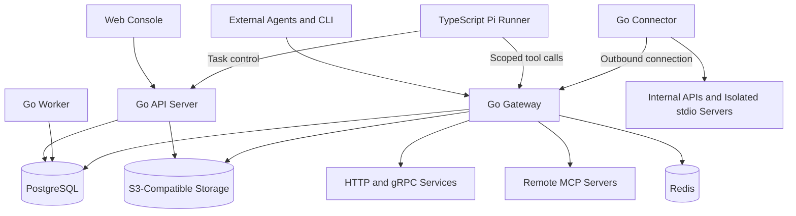

# MCP Gateway

**Governed access to enterprise tools for AI agents.**

MCP Gateway connects AI agents to existing HTTP APIs and remote MCP servers through a governed tool discovery and execution layer. Its Go backend manages upstream connections, reviewed tool contracts, permissions, approvals and bounded responses. A web console provides administration and execution history; Pi is a client for model-assisted tasks. OpenAPI import, gRPC integration and private-network Connectors remain planned.

> **Project status:** Active development. The Go API and MCP gateway, PostgreSQL execution ledger, invitation-only cloud console, and Pi cloud task worker are runnable. The complete production architecture is still being implemented. See [implementation status](docs/implementation-status.md) for delivered capabilities and remaining acceptance gates.

## Cloud Delivery

The product is an invitation-only cloud workspace. Team members sign in with individual accounts, administrators issue invitations, and external clients use revocable API keys. See the [cloud deployment guide](docs/cloud-deployment.md) for HTTPS, identity policy, deployment, backups and operational limits.

## Developer Setup

With Node.js and Docker Compose installed:

```sh
node scripts/bootstrap.mjs
docker compose --env-file .local/compose.env -f deploy/compose/compose.yaml up --build
```

Open the console at `http://127.0.0.1:4782`. Use the private identities created in `.local/identities.json`; keep administrator, operator and approver identities separate. Downstream origins must be explicitly allowed before tools can be registered.

For the delivery workflow, source development, downstream configuration and verification, see the [development guide](docs/development.md). The [ordered work packages](docs/implementation-status.md#development-order) describe the next implementation and acceptance priorities. The [Pi runner guide](apps/agent-runner/README.md) explains how to use an existing local subscription login without sending model credentials to the gateway.

### Working Capabilities

- Sign in, invite teammates, manage member access, revoke API keys and inspect account activity.

- Register and publish HTTP tools with validated JSON Schemas.
- Connect remote Streamable HTTP MCP servers, discover paginated upstream catalogs and import selected tools as disabled drafts with explicit risk.
- Route namespaced MCP tools through the operation ledger, recheck upstream contracts and immediately gate new admissions when a server is disabled.
- Select object and array-element result fields, retain valid pagination cursors and enforce response byte limits before returning data to agents.
- Preview response policies against supplied samples and revise them with version checks while preserving prepared operation snapshots.
- Search the complete authorized tool catalog with bounded cursor pages; load schemas on demand and invoke tools through an authenticated MCP endpoint.
- Prepare fixed actions, approve writes independently and reject duplicate dispatches.
- Inspect durable PostgreSQL operation records and event history in the console.
- Preserve ambiguous writes as `UNKNOWN` instead of automatically sending them again.
- Submit cloud Agent tasks, inspect event/output history, cancel work and resume after approval.
- Run a restricted Pi agent with durable task leases, server-side sessions and intent persistence.

Remote MCP currently supports operator-managed static credentials, text/structured results and bounded POST responses (JSON or SSE), with no upstream OAuth, legacy SSE transport, stdio processes or automatic replay. See the [remote MCP contract](docs/remote-mcp-contract.md) for onboarding, projection rules and compatibility limits.

The sections below describe the target production system. Follow [implementation status](docs/implementation-status.md) for current limitations and [the OpenAPI contract](api/openapi.yaml) for implemented management endpoints.

## Why MCP Gateway

Giving an agent access to a business system creates several engineering responsibilities: finding the right tool, enforcing the caller's permissions, managing configuration changes, handling uncertain outcomes, and explaining what happened.

MCP Gateway is designed to make those responsibilities explicit and reusable across teams. Existing services can become governed agent tools, while service owners retain control over access, versions, and execution policies.

The platform serves two types of users:

- **Agent developers** connect external MCP clients or coding agents to an authorized tool catalog.
- **Business and engineering teams** use the web console to run Pi-powered tasks, inspect evidence, and approve actions.

## Planned Capabilities

| Area | Scope |
| --- | --- |
| Tool integration | Import OpenAPI definitions and Protobuf descriptors; extend existing remote MCP support with upstream OAuth and isolated stdio servers through a Connector. |
| Tool discovery | Add semantic ranking and service/environment filters to the existing paginated lexical catalog. |
| Access governance | Enforce organization, workspace, environment, tool, resource, and field permissions. |
| Configuration lifecycle | Review changes, publish immutable versions, track rollout, and roll back configurations. |
| Reliable execution | Extend the existing operation ledger with downstream outcome reconciliation and adapter-specific idempotency support. |
| Human approval | Bind approval to the exact action, parameters, target environment, and expiration time. |
| Agent workbench | Create tasks, follow execution, inspect evidence, provide input, cancel work, and resume interrupted tasks. |
| Private connectivity | Reach internal services through an outbound-connected Connector with scoped credentials. |
| Evaluation and observability | Compare agent configurations, replay isolated test cases, and trace tasks through tool execution. |

## Target Architecture



| Component | Responsibility |
| --- | --- |
| **Web Console** | Tool onboarding, configuration, tasks, approvals, evidence, and audit views. |
| **API Server** | Identity, administration, task management, approvals, and resumable event streams. |
| **Gateway** | MCP endpoints, tool authorization, execution admission, protocol adapters, and operation records. |
| **Worker** | Discovery synchronization, scheduling, reconciliation, event delivery, and evaluation jobs. |
| **Pi Runner** | Model access, agent sessions, context management, and controlled tool selection. |
| **Connector** | Scoped execution against internal services and isolated local MCP processes. |

The Go services share domain modules and a transactional PostgreSQL database, with separate deployment and access boundaries. Runners and Connectors communicate through authenticated interfaces and do not access the database directly.

## Target Execution Model

A tool request follows a common execution path:

1. Authenticate the caller and resolve the tool version.
2. Validate arguments, permissions, environment, and resource scope.
3. Check approval requirements and reserve the execution budget.
4. Persist the operation intent before contacting the downstream service.
5. Execute through the appropriate adapter or Connector.
6. Validate, redact, and persist the result before reporting completion.

Write operations have a stable business operation ID. A timeout can mean that the downstream action succeeded but its response was lost. In that case, the platform must reconcile the outcome before retrying; it must not assume that a failed connection means nothing happened.

Agent tasks, model sessions, and external operations have separate state. Restoring a conversation does not establish whether a business action has already run. Task recovery therefore combines Pi checkpoints with the operation ledger and recorded evidence.

## Pi Integration

[Pi](https://pi.dev/docs/latest/sdk) provides the agent session and model interaction layer. The host application controls task state, authorization, approvals, execution budgets, and persistence.

The cloud worker consumes PostgreSQL-backed task leases through a private authenticated control API. Browser users can follow task events, cancel work and explicitly resume after approval or credential configuration. An operator configures the server subscription in its dedicated Pi volume; credentials are not uploaded as part of Gateway deployment. The local Pi CLI remains available for development and integration. See [cloud deployment](docs/cloud-deployment.md#cloud-agent-worker) and the [task contract](docs/cloud-run-contract.md).

Tool permissions are enforced by the platform on every invocation. Repository content, tool responses, and model output cannot grant additional access.

## Example Workflow

A data operations team asks why a scheduled job failed:

- The agent discovers the authorized job, log, and deployment tools.
- It gathers evidence and produces a diagnosis with explicit uncertainties.
- It prepares a retry action for a specific job and environment.
- An authorized user reviews and approves the action.
- The platform executes it, checks the actual job status, and records the outcome.

The same tool governance and execution model can support service investigations, business reporting, and cross-system status checks.

## Target Technology and Deployment

- **Backend:** Go, the official MCP Go SDK, gRPC, and pgx.
- **Agent runtime:** TypeScript, Node.js, and the Pi SDK.
- **Web console:** React, TypeScript, and Vite.
- **System of record:** PostgreSQL.
- **Search:** PostgreSQL full-text search and pgvector.
- **Artifacts:** S3-compatible object storage.
- **Caching and rate limits:** Redis.
- **Observability:** OpenTelemetry and Prometheus-compatible metrics.
- **Deployment targets:** Docker Compose for dedicated environments and Kubernetes for high-availability deployments.

Production acceptance includes tenant isolation, protocol interoperability, approval replay protection, failure injection, recovery of uncertain operations, load testing, and backup restoration.

## Design References

- [Uber Engineering: Designing MCP Gateway](https://www.uber.com/jp/en/blog/designing-mcp-gateway/)
- [Model Context Protocol](https://modelcontextprotocol.io/)
- [Official MCP Go SDK](https://github.com/modelcontextprotocol/go-sdk)
- [Pi SDK](https://pi.dev/docs/latest/sdk)

This is an independent implementation informed by publicly documented architecture patterns.
