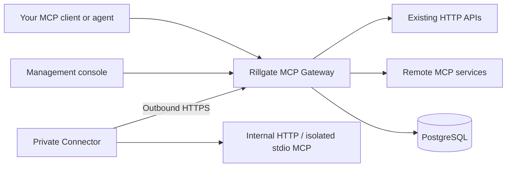

# Rillgate

**One MCP endpoint for your APIs and tools.**

[Website — EN](https://rillgate.cn/en/) · [官网 — 中文](https://rillgate.cn/zh/) · [Workspace](https://rillgate.cn/console/) · [Architecture](docs/architecture.md)

Rillgate connects existing MCP clients and agents to remote MCP services, HTTP APIs and private tools. Register a service, publish selected tools, grant an access key, then let your existing client search and call them through one endpoint.

The Go gateway handles discovery, credentials, permissions, execution records and bounded results. The React console manages services, access keys and call history in English or Simplified Chinese, with a language preference shared with the website. No Pi task, model account or separate Rillgate agent application is required.

> **Delivery status:** The gateway core is deployed as `20261008-cloud.26` from source `bb9f234ea0f38a7d61272458cb9ed253fd269348`, adding reviewed OpenAPI JSON import and an x/text security update. All six exact-source CI checks, release backup/health gates and affected cloud browser checks passed. Earlier core SDK acceptance and public-provider boundaries remain recorded separately. See the [release evidence](docs/evidence/openapi-import-release-2026-10-08.json) and [implementation status](docs/implementation-status.md) for the supported boundary.

## How it works



1. **Connect:** register a remote MCP service, define a fixed HTTP JSON tool (manually or from a reviewed OpenAPI operation), or configure an outbound private Connector
2. **Publish:** review tool contracts, risk classification and response policy; enable selected tools
3. **Grant:** create a machine access key scoped to explicit tools or services
4. **Use:** configure the gateway MCP URL and Bearer key in an existing client, then search, inspect schemas and call tools
5. **Inspect:** review recorded outcomes, latency totals, errors and any required approvals

## Core capabilities

| Area | Implemented behavior |
| --- | --- |
| Service access | Remote Streamable HTTP MCP, bounded HTTP JSON APIs, encrypted header credentials, a pre-registered upstream OAuth profile, outbound Connector HTTP and isolated rootless Podman stdio |
| Tool discovery | Service filtering, explainable lexical ranking, permission filtering before count/limit, bounded cursor pages and schemas fetched only when selected |
| Access keys | Explicit discovery/invocation scopes, tool/service grants, one-time key display, expiry, rotation and live revocation |
| Invocation | One `call_tool` request handles preparation and execution; stable idempotency keys preserve the operation ledger and suppress duplicate dispatch |
| Approval policy | Administrator-managed `required` / `none`, version checks and audit; legacy writes retain independent approval until explicitly changed |
| Results | Output-schema checks, structured field selection, cursor preservation, secret-name redaction, byte limits and opt-in expiring large-result references |
| Reliability | Bounded retry and process-local circuit breaking for eligible HTTP read-only GET calls; unknown writes are never automatically replayed |
| Operations | Durable state/events, filtered history, independent UNKNOWN evidence, admission limits and outcome/duration aggregates |
| Management | Connection diagnostics, immutable tool versions, reviewed changes, scheduled catalog checks and response-policy preview |
| Delivery | Committed-source packaging, checked migrations, encrypted local backups, isolated restore verification and configurable host health collection |

### Client-facing MCP tools

| Tool | Purpose |
| --- | --- |
| `search_tools` | Find authorized summaries, optionally narrowed by `server_id` |
| `get_tool_schema` | Read one selected tool's contracts and policy |
| `call_tool` | Prepare and execute one authorized intent, or return pending/recorded state |
| `get_operation` | Inspect the durable outcome |
| `read_result` | Read a bounded chunk of an authorized, unexpired large result |
| `prepare_action` | Existing explicit preparation interface |
| `invoke_tool` | Existing execution-by-operation-ID interface |

Use the same idempotency key for the same intent. A pending approval is not success; `UNKNOWN` is not proof of failure. The gateway never promises exactly-once business effects in arbitrary upstream systems.

## Supported boundaries

- Remote MCP uses Streamable HTTP, including bounded JSON/SSE responses to the original POST. Legacy SSE transport, standalone streams/resumption and generic MCP replay are unsupported.
- `server_id` filtering applies to imported MCP tools. Search is lexical, with literal punctuation and whitespace-separated terms; it is not semantic search or automatic Chinese segmentation. [Measured discovery fixture](docs/discovery-evaluation.md).
- Large-result storage requires an explicit MCP response policy and object `structuredContent`. The projected envelope is limited to 1 MiB; only projected structured JSON is stored separately. Default retention is one hour, configurable from 60 seconds to 24 hours, with 100 MiB / 1,000 retained artifacts per workspace. Reads check live permission and expiry. This is not arbitrary file storage or automatic summarization.
- Automatic retry applies only to HTTP tools classified `read` using GET, with at most two attempts within the original deadline. It excludes writes, MCP/Connector calls, HTTP 429, validation failures and uncertain business effects. Circuit state is local to one gateway process.
- Microsoft Learn currently embeds a changing session identifier in its input-schema constraints. This supplier profile is not supported by the fresh-session adapter; genuine schema changes remain blocked. [Compatibility observation](docs/remote-mcp-contract.md).
- OAuth has automated protocol/refresh tests for the [documented registration profile](docs/upstream-oauth.md). Real third-party provider consent acceptance is tracked separately and is not claimed from local fixtures.
- The current deployment topology is a single host. High availability, an independently commissioned off-host backup destination and external alert delivery are not established.

See the [MCP compatibility matrix](docs/mcp-compatibility.md), [remote MCP contract](docs/remote-mcp-contract.md), [discovery contract](docs/tool-discovery-contract.md), [OpenAPI import profile](docs/openapi-import.md), [Connector guide](docs/private-connectors.md) and [cloud deployment guide](docs/cloud-deployment.md).

## Developer setup

With Node.js and Docker Compose installed:

```sh
node scripts/bootstrap.mjs
docker compose --env-file .local/compose.env -f deploy/compose/compose.yaml up --build
```

Open `http://127.0.0.1:4782/console/`. Private development identities are created in `.local/identities.json`; keep requester and approver identities separate when testing approval. Downstream origins must be explicitly allowed. The cloud product uses individual invitation-only accounts and revocable machine keys.

For source development, tests and release gates, see [development](docs/development.md). CI checks the declared Go files' statement coverage and frontend TypeScript logic coverage; these scoped checks do not claim whole-repository or React component coverage of 90%.

## Scope and next work

The [gateway roadmap](docs/gateway-roadmap.md) prioritizes a complete connection → discovery → invocation → result workflow using existing MCP clients. Agent workbench expansion, multi-agent orchestration, standalone client products, model-account management and enterprise account expansion are outside this delivery.

The existing [Pi runner](apps/agent-runner/README.md) remains an optional integration client with its original five-tool interface. It is maintained for compatibility and does not yet expose the new large-result reader. Future needs can drive broader OpenAPI/Protobuf import, additional OAuth providers, semantic retrieval, distributed telemetry and high availability.

## Design references

- [Uber Engineering: Designing MCP Gateway](https://www.uber.com/jp/en/blog/designing-mcp-gateway/)
- [Model Context Protocol](https://modelcontextprotocol.io/)
- [Official MCP Go SDK](https://github.com/modelcontextprotocol/go-sdk)
- [Pi SDK](https://pi.dev/docs/latest/sdk)

This is an independent implementation informed by publicly documented architecture patterns.
