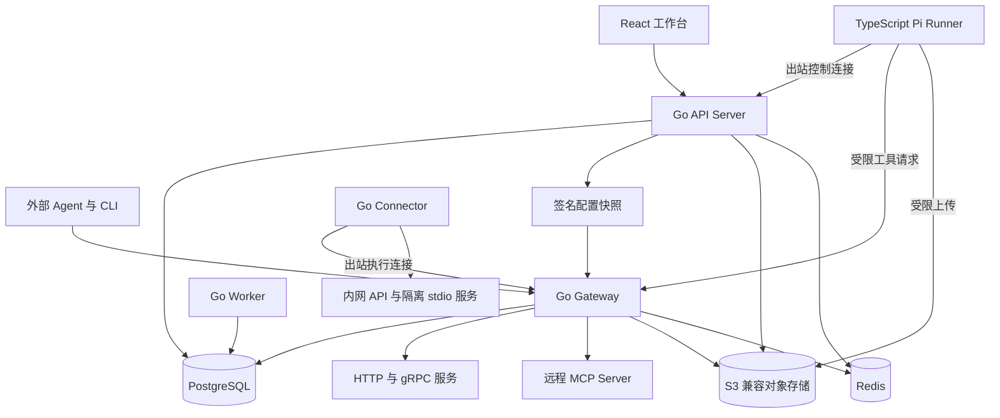
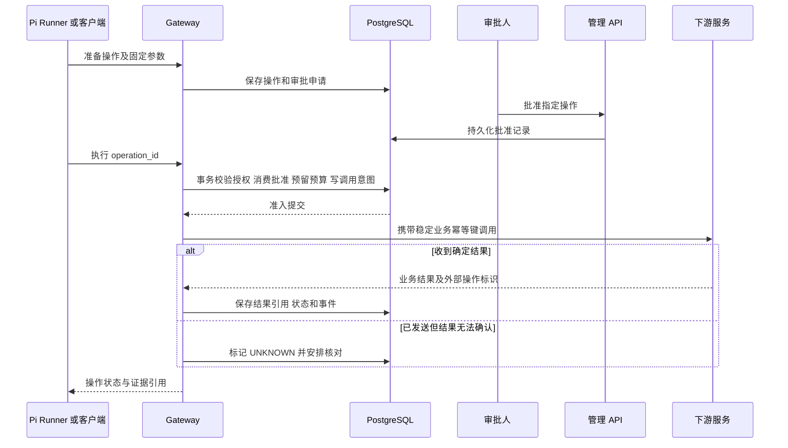

# Rillgate（MCP Gateway）系统架构设计

更新日期：2026-10-08

本文将 [产品设计](product-design.md) 细化为服务边界、接口契约、数据模型、运行链路与部署方案。采用 **Go 控制面与工具执行面、TypeScript Pi Runner、出站连接的内网 Connector、PostgreSQL 事务存储**。这是目标架构，文中的进程、目录和接口尚不代表已实现。

近期开发顺序以 [网关开发方案](gateway-roadmap.md) 为准，复用现有服务边界，优先完善接入、按需发现和调用体验。首个完整版本限定为网关核心；独立客户端、Agent 任务工作台扩展和多 Agent 编排不在范围内。Pi 作为可选验证客户端，不是网关运行依赖。cloud.23 已部署管理员配置的运行时审批策略并完成对应迁移与验收，旧写工具仍使用保守默认值；后续版本同样必须按准确源码完成迁移与验收。

## 当前网关核心源码边界

下文保留长期目标，当前实现和发布验收按以下边界理解：

- 产品入口是现有 MCP 客户端，管理端组织服务与工具、访问密钥和调用记录；不依赖 Pi 任务，暂不扩展 Agent 工作台或多 Agent 编排。
- 网关对外提供七个工具：`search_tools`、`get_tool_schema`、`call_tool`、`get_operation`、`read_result`，以及兼容的 `prepare_action`、`invoke_tool`。Pi 联调客户端保留既有五工具接口。
- `search_tools` 支持 MCP `server_id` 过滤和明确的词法排序理由；权限在分页与计数前过滤，摘要与完整 schema 分开加载。不包含环境过滤、向量检索或自动中文分词。
- `call_tool` 在一次调用中组织准备和 READY 执行。审批策略为管理员版本化发布的 `required` / `none`；旧写工具要求审批，策略放宽不自动释放已有待审批操作，执行前重查最新权限与策略，UNKNOWN 写入不重放。
- 大结果只支持 MCP 的对象 structuredContent，先校验和投影，再按显式策略返回引用。投影后 envelope 上限 1 MiB，TTL 60–86400 秒，工作空间上限 100 MiB / 1000 份。PostgreSQL 存储 JSON，`read_result` 按权限、有效期和字节游标读取；不是通用文件存储或模型压缩。
- 自动重试只适用于 HTTP 只读 GET 的部分临时连接错误与 502/503/504，最多两次、共用原期限；进程内熔断不跨实例共享。MCP、Connector 和写操作均不自动重放。
- Go CI 对声明文件逐文件检查至少 90% 语句覆盖；前端 TypeScript 逻辑采用聚合 95% 行、90% 分支/函数门槛，TSX 不包含在内。不能据此声称全仓或 UI 覆盖达标。

以上核心能力已在 `20261006-cloud.23` 完成对应版本的 CI、外部 MCP SDK 与云端验收。当前记录部署为 `20261008-cloud.30`，源码 `ef8b28d2669dbd8fa3bdb3292b4e379c73c3c277`；该次更新增加原 POST SSE 目录变更通知、分页观察失效与发送前防护，准确源码 CI、云端 SDK 只读调用、幂等重放与撤权回归通过，见[发布证据](evidence/mcp-catalog-release-2026-10-08.json)。通知场景由实际 HTTP/SDK 隔离测试验证；真实供应商持续推送未验收。上游会话管理记录在 [cloud.29](evidence/mcp-session-release-2026-10-08.json)。跨会话契约诊断及 EN/ZH 展示验收记录在 [cloud.27](evidence/mcp-compatibility-release-2026-10-08.json)。此前 cloud.26 已交付受限 OpenAPI JSON 导入并修复 x/text 漏洞。后续源码变更仍需独立验收，不能据此视为已部署。真实 OAuth 供应商授权、真实业务写入和生产负载尚未验收，单机部署不宣称高可用。范围见 [实现状态](implementation-status.md)，各次证据见 [验证记录](verification.md)。

## 云端交付决策

产品采用邀请制云端工作台，面向本人和团队。网页、API、MCP 入口和持久化数据统一部署在云服务器。本地启动配置用于开发联调。现有云端实现采用账号密码、一次性邀请、服务端会话和可撤销 API Key；企业 OIDC 是后续身份接入能力。Pi 的产品目标为云端受控执行器，当前 CLI 是联调客户端。具体已交付范围与部署约束见 [云端部署](cloud-deployment.md) 和 [实现状态](implementation-status.md)。

## 1 核心架构决策

| 决策 | 具体设计 | 解决的问题 |
| --- | --- | --- |
| 工程组织 | 一个项目仓库，Go 模块化后端与 TypeScript 工作区共同维护 | 统一契约、测试与发布，降低跨仓同步成本 |
| 后端边界 | API、Gateway、Worker 独立进程，共用受控领域模块 | 管理请求、工具流量与后台工作独立扩容 |
| Agent 执行 | Pi SDK 运行在独立 Node.js 进程，通过契约接入 | 隔离模型等待、会话和账号环境 |
| 内网接入 | Connector 主动连接 Gateway，仅接收已授权操作 | 接入内部系统，控制入站暴露与执行范围 |
| 数据一致性 | 一个 PostgreSQL 业务库，审批、操作与预算使用本地事务 | 原子完成执行准入，避免跨服务事务 |
| 调度 | PostgreSQL 工作记录、租约和 Outbox | 持久化工作、重复投递和故障恢复 |
| 实时体验 | 浏览器通过 SSE 读取已提交事件 | 刷新与断线恢复，避免依赖某个连接存活 |
| 配置发布 | 不可变发布快照，网关原子切换内存视图 | 热更新、差异审查、回滚和结果可复现 |
| 工具协议 | 官方 MCP Go SDK 包装协议，领域层使用统一执行契约 | 将协议兼容与业务执行规则分开维护 |
| 权限 | 网关强制鉴权，Runner 只持有短期任务授权 | 模型输出不能产生权限 |

生产能力由事务、隔离、恢复、观测和验证共同保证。模块根据领域组织，部署进程根据流量、故障和信任边界划分。

## 2 总体架构



模型访问发生在 Pi Runner。Gateway 无需调用模型即可完成工具发现、鉴权与执行；工具说明生成、语义索引和 Agent 任务在相应后台执行域运行。

所有公网流量经过 TLS 入口，管理 API、MCP 和内部 Runner 接口使用独立路由与认证策略。PostgreSQL、Redis、对象存储管理接口不向普通客户端开放。

## 3 部署进程与职责

| 进程 | 职责 | 持有的数据或连接 |
| --- | --- | --- |
| `api-server` | OIDC 会话、管理 API、任务与审批 API、SSE、Agent Runner 控制通道 | 管理领域数据库权限、浏览器会话、Runner 连接 |
| `gateway` | MCP 与内部工具接口、执行准入、协议适配、Connector 控制通道 | 已发布配置、执行领域数据库权限、下游连接池 |
| `worker` | 导入同步、发布分发、工作调度、结果核对、Outbox、评测与保留期清理 | 后台任务租约、扫描游标和领域数据库权限 |
| `agent-runner` | Pi 会话、模型连接、工具桥接、检查点与任务产物 | 单用户或组织绑定的模型凭据、受限工作区 |
| `connector` | 内网 API、受控 stdio 子进程和命令适配器执行 | 指定环境的凭据、执行沙箱、短期工作授权 |

API、Gateway 和 Worker 使用同一 Go 工程的领域服务，不通过复制业务逻辑维持一致性。部署账户权限分别收敛，Runner 与 Connector 不直接访问业务数据库。

Worker 内的任务处理器按工作类型分队列和并发池。导入、评测、回调和恢复可采用相同二进制的独立部署池，避免大任务拖延审批恢复与关键回调。

Agent Runner 和 Connector 各自注册、撤销和绑定环境。同一机器可以运行两者，但使用独立进程、身份和工作目录；持有模型账号不自动获得内网业务凭据。

## 4 Go 领域模块

| 模块 | 管理的数据与规则 |
| --- | --- |
| `identity` | 组织、成员、服务主体、OIDC 映射和身份停用 |
| `registry` | 服务、连接器定义、工具及不可变工具版本 |
| `release` | 配置校验、审批、签名快照、实例生效与回滚 |
| `policy` | 结构化角色规则、环境和资源属性、字段策略、撤权修订号 |
| `approval` | 操作申请、批准、拒绝、过期和一次性授权 |
| `execution` | 操作准入、幂等、尝试记录、适配器调用和结果核对 |
| `runs` | Agent 配置、任务状态、阶段、工作租约、预算和终态 |
| `runners` | 注册、能力声明、短期身份、出站连接和指令收据 |
| `catalog` | 目录过滤、全文与向量检索、Schema 按需读取 |
| `artifacts` | 产物申请、上传确认、哈希、可见范围和保留策略 |
| `events` | 任务事件、审计事件、Outbox、订阅和回调 |
| `evaluation` | 数据集、工具回放、评分、版本比较和发布门禁 |

依赖方向为传输层调用应用服务，应用服务组织领域规则与仓储接口，基础设施实现数据库、MCP、下游协议和对象存储访问。领域模块不依赖 HTTP Handler、Pi SDK 或前端类型。

跨模块事务由应用服务显式传入同一事务上下文。例如执行准入同时调用审批、预算与操作仓储；业务模块之间不绕过接口修改对方表。数据库账户只获得对应应用服务需要的权限。

## 5 接口与身份契约

### 5.1 外部与内部接口

| 入口 | 协议 | 契约范围 |
| --- | --- | --- |
| 浏览器与自动化管理 | HTTPS REST，OpenAPI | 服务、工具、发布、Agent、任务、审批、评测与产物 |
| 浏览器任务进度 | HTTPS SSE | 持久化任务事件，使用 `Last-Event-ID` 续读 |
| 外部工具客户端 | MCP Streamable HTTP | 已发布且当前身份可访问的工具 |
| 本地 MCP 服务 | stdio，限 Connector 内部 | 生命周期、工具调用、输出限制与子进程回收 |
| Runner 控制 | 带身份校验的 gRPC 双向流 | 分配、心跳、检查点、事件、完成请求与取消 |
| 平台工具调用 | 内部 gRPC | 与 MCP 入口共用的 `ExecutionService` |
| Connector 执行 | 出站 gRPC 双向流 | 指令、签收、结果和取消，不提供任意远程 Shell |

外部协议由网关终止，下游连接由适配器建立。网关不是简单转发字节的透明代理；协议元数据、目标身份、工具名称与参数均经过映射和检查。

### 5.2 调用上下文

每次调用形成可信 `ActorContext`：组织、工作空间、用户或服务主体、Agent、任务、环境、授权范围、策略修订号和 Trace。外部提交的租户、用户与角色字段不直接作为可信身份。

Runner 的短期任务令牌绑定 `runner_id`、`run_id`、租约代次、工具集合和截止时间，Audience 绑定目标接口。Gateway 同时检查用户授权、Agent 授权、工具策略、资源范围和当前撤权状态。

下游认证通过 `CredentialProvider` 获取，仅向指定适配器提供目标服务凭据；日志与返回数据不包含凭据。网关令牌不作为下游通用访问令牌透传。[MCP 授权规范](https://modelcontextprotocol.io/specification/2026-07-28/basic/authorization)

### 5.3 协议兼容

项目选择官方 MCP Go SDK 实现客户端与服务端。其当前兼容表列出了 2026-07-28 及旧修订支持；项目仍需对锁定的 SDK、Pi 版本和实际客户端组合进行互通验收。[MCP Go SDK](https://github.com/modelcontextprotocol/go-sdk)

设计支持 2026-07-28 和 2025-11-25 的工具调用路径，以兼容矩阵明确能力。新修订的请求模型与旧修订的会话握手分别适配；旧连接的会话状态由所属实例管理，跨实例路由使用短期会话目录。会话丢失后重新建立协议连接，并按业务操作 ID 查询结果。

HTTP 连接、JSON-RPC 请求、MCP 旧会话与业务任务是不同标识。连接取消或会话重建不等于外部业务操作已撤销。[MCP 传输规范](https://modelcontextprotocol.io/specification/2026-07-28/basic/transports)

## 6 控制面与工具发布

接入配置转换为统一的 `ServiceDefinition` 和 `ToolDefinition`。工具定义包含稳定 ID、命名空间、输入输出 Schema、协议映射、风险级别、字段策略、超时、幂等能力、结果查询方式和凭据引用。

导入器定期读取授权的 OpenAPI、Protobuf 描述文件和 MCP 工具目录，将变化保存为草稿。描述生成可以由 Pi 辅助，但地址、Schema、权限和副作用能力由确定性校验及负责人审核确认。

发布链路：草稿校验 → 差异审查 → 兼容性与评测门禁 → 审批 → 创建不可变快照 → 分发 → 实例确认。快照包含内容哈希、发布序号、签名、工具版本和策略引用；不包含明文凭据。

实例加载完整快照、校验并预编译映射后原子切换。失败实例继续使用仍有效的旧快照并上报告警；发布页区分期望版本、实际版本和失败原因。回滚发布新的序号并指向历史内容。

任务固定工具内容版本，但每次调用重新检查停用、授权和凭据状态。撤权通过独立递增修订号及短期有效的策略快照传播，5 秒生效目标涵盖实例确认与拒绝过期快照；失联实例不能无限使用旧权限。

## 7 工具发现与统一执行

### 7.1 工具目录

目录使用 PostgreSQL 全文索引与 pgvector 语义索引。向量生成属于独立的索引工作，记录模型、维度与版本，可以使用本地嵌入模型；不假定用户的生成模型订阅提供嵌入接口。

检索先按组织、工作空间、环境和当前授权确定可见集合，再召回与排序，返回少量摘要。读取完整 Schema 和调用时再次校验权限。向量服务不可用时退化为授权范围内的关键词检索，并暴露降级指标。

缓存键包含身份授权范围与修订号、环境和配置版本。字段过滤、分页游标、产物读取和缓存命中都执行同一权限规则；跨工作空间不能共享未隔离的检索结果。

### 7.2 对 Agent 的工具接口

工作空间 MCP 端点提供 `search_tools`、`get_tool_schema`、`prepare_action`、`invoke_tool` 和 `get_operation` 等平台工具；服务级端点可发布直接工具接口。两种入口最终调用同一执行服务。

只读工具可直接调用。写操作先通过 `prepare_action` 获得服务端操作 ID，固定业务参数、目标与版本，再进入审批或已授权执行。Pi 桥接层和 CLI 自动管理操作 ID，外部客户端按公开契约使用；JSON-RPC 请求 ID 不充当业务幂等键。

需要审批时返回操作 ID 和业务状态 `WAITING_APPROVAL`，不向下游发送动作。Pi 宿主保存检查点并释放运行槽位；外部客户端通过状态工具或审批页面继续。协议请求完成不代表业务动作成功。

### 7.3 执行流水线

1. **认证与解析**：建立可信身份，解析工具和固定内容版本，限制输入大小。
2. **规范化与授权**：校验 Schema、目标环境及资源，补齐受控默认值，计算参数哈希。
3. **事务准入**：重新检查操作状态、当前权限、审批、租约和预算，写入调用意图。
4. **路由与调用**：选择 HTTP、gRPC、远程 MCP 或 Connector 适配器，使用目标凭据执行。
5. **结果处理**：校验业务成功条件、执行字段策略、脱敏、投影、分页和大小限制。
6. **持久化与交付**：保存证据，提交操作状态与事件，返回结果或受限产物引用。

投影控制输出大小，字段策略控制可见性，两者分别执行。不能先将未脱敏结果写入通用产物，再仅在页面隐藏字段。对无输出 Schema 的工具，使用保守的文本大小与数据分类策略，并标明结果结构无法验证。

适配器约定 `Validate`、`Execute`、`QueryOutcome` 与 `Cancel` 能力。只有下游确实支持时才声明结果查询或取消；Schema 中的只读提示不直接等于平台认可的安全能力。

## 8 写操作事务与幂等

操作记录代表一次业务意图，尝试记录代表一次实际发送。相同业务操作可以有多次安全尝试，但不能因超时自动创建新的业务意图。



准入事务通过行锁或条件更新完成以下动作：

- 检查操作仍可执行，调用主体与目标没有变化。
- 校验审批绑定的参数哈希、工具版本、环境、有效期和策略。
- 将批准原子保留给该操作，同步预留组织与任务的对应执行预算。
- 写入执行意图、尝试记录和 Outbox；事务失败时全部回滚。

调用前将操作原子转为 `DISPATCHING`，再发送请求。数据库事务与外部请求之间不存在原子提交，因此进程在发送窗口崩溃时保守认定结果未知。下游支持幂等时复用同一键；支持结果查询时先核对；两者都不支持时进入人工处置。

操作状态为 `PREPARED`、`WAITING_APPROVAL`、`READY`、`DISPATCHING`、`RUNNING`、`SUCCEEDED`、`FAILED`、`UNKNOWN`、`CANCELLED`。审批拒绝和过期进入明确失败原因；已发送操作的取消结果不能从连接断开推导。

幂等作用域包含组织、工作空间、目标环境、工具和业务操作。相同键但参数哈希不同返回冲突；旧键超出可查询保留期后拒绝不确定重放。幂等墓碑至少覆盖工具声明的外部重试与结果保留窗口。

## 9 Pi Runner 与任务恢复

### 9.1 任务分配

API 创建 Run 时冻结 Agent 配置、工具集合、模型连接、Skill、输入与预算，并在同一事务中写事件与可调度工作。Worker 采用短事务领取到期工作，按组织公平分配，写入 Runner 工作箱。

Runner 主动连接 API，按能力与模型连接归属领取任务。工作箱在 PostgreSQL 持久化，连接用于通知与投递；实例重启或通知丢失后可以重新读取。接收、心跳与结果消息包含任务、租约代次和消息序号。

工作租约默认 30 秒、每 10 秒续约，以数据库时间判断。新领取增加 fencing token；旧 Runner 的事件、检查点和工具请求被拒绝。网关直接核验运行代次和取消状态，不能只依赖尚未过期的令牌。

### 9.2 Pi 的职责与宿主边界

Runner 通过 Pi SDK 创建会话并显式提供模型、资源加载器和工具桥。Pi 负责模型交互、上下文和阶段内工具选择；宿主控制任务授权、暂停、预算、持久化与完成判定。

生产会话只加载管理员发布的资源，禁用对工作目录中任意扩展的自动执行。默认工具集合只包含受控网关桥和受限产物读取。需要 Shell 的工具在 Connector 隔离环境中执行，模型账号进程不承担通用命令执行。

用户订阅凭据保留在绑定的 Runner 环境。个人任务只调度到该身份允许的 Runner；凭据失效进入 `WAITING_CREDENTIALS`。生成模型与嵌入模型的连接和计量分别管理。

模型调用通过宿主 Provider 包装器执行，每次请求和重试前向控制面预留预算，按实际用量结算；输出 token 上限用于限制未结算风险。进程中断且用量未知时保留预留并对账，不能直接释放后重复花费。只有允许的模型连接可以发起网络请求，Pi 的自动重试同样受预算和任务期限约束。

Pi SDK 提供会话管理及事件接口，宿主需要显式接入所选工具与扩展；SDK 会话恢复方式以锁定版本的接口为准。[Pi SDK](https://pi.dev/docs/latest/sdk)

### 9.3 检查点与工具调用屏障

检查点包含 Pi 会话引用、已完成模型轮次、待执行工具调用、工具结果引用、预算余量和已提交事件序号。只有产物上传成功且数据库引用提交后，平台才确认检查点。

执行工具前，宿主先提交包含完整工具请求的检查点，再允许网关发送外部操作。调用 ID 由宿主按任务、模型轮次及工具调用 ID 稳定映射；模型不能通过重新填写 ID 绕过重复检查。

工具完成后，宿主记录操作结果与会话检查点。若外部动作已完成而会话结果未保存，恢复器从执行账本补齐该调用结果，再继续 Pi；未知结果保持暂停。未提交的模型流可以重新生成，但不能提前执行其中尚未固定的工具请求。

这要求 Pi 桥接器具备“恢复会话并补齐待完成工具结果”的测试契约。落地时使用 SessionManager 支持的接口实现，并验证对应 SDK 行为；不能用直接修改内存消息替代持久化上下文恢复。

### 9.4 Run 状态机

| 当前状态 | 触发条件与下一状态 |
| --- | --- |
| `QUEUED` | 成功分配后进入 `RUNNING` |
| `RUNNING` | 需要输入、批准或登录时进入对应等待状态；租约丢失进入 `RECOVERING` |
| 等待状态 | 条件满足且重新授权后回到 `QUEUED`，继续同一个业务任务 |
| `RECOVERING` | 核对检查点与工具结果后排队；结果未知则等待人工核对 |
| 可取消状态 | 用户取消后进入 `CANCELLING`，停止新调用并跟踪在途操作 |
| `CANCELLING` | 编排停止后进入 `CANCELLED`，未确定的外部操作独立保留核对状态 |
| `RUNNING` | 结果契约、证据和操作状态均满足时进入 `SUCCEEDED`；不可恢复错误进入 `FAILED` |

等待状态包括 `WAITING_INPUT`、`WAITING_APPROVAL` 和 `WAITING_CREDENTIALS`，不占用执行槽位。失败或成功任务重跑创建新 Run 并引用原任务；暂停恢复继续原 Run。终态不能由模型自由文本直接写入。

## 10 Connector 与内网执行

当前 Connector 通过出站 HTTPS 轮询连接 Gateway，绑定工作空间、固定目标名称和本地配置指纹；持久化任务领取与执行确认相互独立，详见 [已实现的 Connector 契约](private-connectors.md)。以下 gRPC 和更细粒度隔离描述属于目标架构。

Connector 注册后绑定组织、环境、允许的适配器和资源范围，通过出站 gRPC 连接 Gateway。Gateway 将指令写入持久化工作箱；持有连接的实例读取并发送，连接断开后新实例继续处理未确认指令。

指令包含操作 ID、已批准参数摘要、工具版本、目标地址限制、截止时间和短期执行票据。Connector 核验票据后签收，执行前再次确认操作状态；写操作授权无法确认时停止发送。

命令签收与执行完成分别确认。Connector 保存有界的本地执行日志，记录操作 ID 和外部操作标识；重启后向平台核对，不能因工作箱再次投递就再次执行副作用。执行状态和结果由 Gateway 接收后持久化。

HTTP 与 gRPC 适配器只能访问配置批准的地址及路径。stdio 服务按组织、环境、身份和服务版本隔离进程，限制网络、文件、输出大小和资源；普通 Connector 不挂载宿主 Docker socket。

取消为尽力停止，不能保证已经发生的业务动作被撤销。断网期间不接收新工作，过期指令不能执行；独立清理器按租约检查残留进程与环境。

## 11 数据模型与存储边界

所有业务主键与外键携带组织或工作空间归属。应用层鉴权与数据库行级策略同时生效；服务数据库角色不得绕过租户隔离，连接池通过事务级上下文设置当前租户。

跨租户调度通过专用受审计的领取函数读取工作 ID、归属与租约元数据；领取后使用所属租户上下文访问任务正文。普通 API 和网关查询不能使用调度专用权限。

| 数据表组 | 关键约束 |
| --- | --- |
| `organizations`、`workspaces`、`memberships` | 身份来源与成员状态唯一；跨租户引用受约束 |
| `services`、`connections`、`credential_refs` | 目标环境与凭据归属固定，明文凭据不入库 |
| `tools`、`tool_versions`、`releases` | 稳定工具 ID，内容版本不可变，发布序号单调递增 |
| `policies`、`policy_revisions` | 权限修订可追踪，紧急撤销独立于内容版本 |
| `agents`、`agent_versions`、`runs` | 配置快照固定，工作空间内创建幂等键唯一 |
| `work_items`、`runner_assignments`、`checkpoints` | 工作唯一键、租约代次、检查点序号与条件提交 |
| `operations`、`operation_attempts` | 业务幂等键与参数哈希绑定，一次业务意图关联多次尝试 |
| `approvals`、`grants`、`budget_reservations` | 批准绑定操作，授权单次消费，预算原子预留 |
| `artifacts`、`reports` | 对象哈希、数据分类、可见范围、保留期与上传状态 |
| `run_events`、`audit_events`、`outbox` | 任务内事件序号唯一，投递可重试，审计追加保存 |
| `evaluation_cases`、`evaluation_runs` | 数据集、工具及评分配置版本固定 |

任务领取索引覆盖状态、到期时间与租户；事件按任务和序号读取；操作索引覆盖幂等键、未知状态与最近核对时间。大事件和审计表按时间分区，清理仍遵守问题与报告的保留引用。

对象存储采用“申请上传 → 限定对象键与大小 → 上传 → 服务端校验哈希 → 提交引用”的流程。未提交对象延迟清理；短期下载授权在签发前重新鉴权，不能仅凭不可猜测 URL 获得访问。

Redis 保存短期目录缓存、会话路由提示和速率计数，不保存唯一的任务、批准或操作事实。Redis 丢失后从数据库重建；受配额保护的调用在无法保证限额时拒绝，不默认为无限放行。

## 12 事件 审计与前端

业务状态、相关事件和 Outbox 在同一事务提交。Outbox 投递采用至少一次语义，消费者根据事件 ID 去重；Webhook 回调使用签名、固定事件标识、有限退避及死信记录，接收方负责业务幂等。

SSE 从数据库读取已提交事件，Redis 只负责唤醒。事件带 `run_id`、`seq`、类型、时间和结构化数据；客户端重连后按序号补齐。历史已过保留期时返回重新获取任务快照的明确响应，不静默遗漏事件。

模型增量可以分批持久化后推送，已确认模型轮次、工具结果、审批和终态必须可靠保存。平台不采集供应商未提供的内部推理；展示可观察的模型输出、工具动作和宿主决策依据。

前端使用 React、TypeScript 和 Vite；服务端状态通过查询缓存管理，SSE 更新失效标记及任务时间线。筛选和分页进入 URL，配置编辑状态保留在页面；批准操作展示服务端提供的不可变摘要并携带版本条件提交。

主要页面对应工具目录、服务接入、配置发布、Agent 配置、任务、审批、审计、评测和组织管理。权限控制在服务端完成，前端按钮可见性仅用于交互提示。

## 13 部署与故障边界

提供专用环境的 Docker Compose 部署与高可用 Kubernetes 部署。集群内 API 和 Gateway 多副本分散调度，Worker 按任务池扩容，Runner 按归属和资源能力扩容，PostgreSQL 采用具备故障切换与连续备份能力的部署。

公网入口与内部 Runner 接口使用分离的监听及访问规则。就绪检查验证可读配置、数据库和授权新鲜度；优雅退出停止领取工作，等待在途请求或明确转移租约。升级通过锁定协议版本及新增兼容字段支持滚动发布。

| 故障 | 对外行为与恢复 |
| --- | --- |
| API 不可用 | 管理与新任务受影响；直连工具调用仅在配置、授权及数据库有效时继续 |
| Gateway 实例丢失 | 客户端重连；已发送写操作按操作 ID 核对，不能按连接失败盲目重试 |
| Worker 丢失 | 租约到期后其他 Worker 接管持久化工作 |
| Pi Runner 丢失 | 从确认的检查点及执行账本恢复，模型凭据需在目标 Runner 可用 |
| Connector 离线 | 对应环境工具不可用，待执行命令受有效期约束 |
| PostgreSQL 不可用 | 拒绝新任务与新工具执行，避免产生无账本操作；追踪在途未知结果 |
| Redis 不可用 | 缓存降级，持久化工作不丢失；配额不可验证的请求拒绝 |
| 对象存储不可用 | 需要证据的操作无法提交成功结果，已发生动作保留待核对状态 |
| 模型连接过期 | 任务等待凭据恢复，普通已授权工具调用仍可用 |

备份恢复覆盖数据库、对象和密钥系统的恢复依赖。只保存密钥引用不能恢复已丢失的解密密钥，部署手册必须定义密钥系统自身的恢复和验证方式。

发布使用签名镜像、依赖清单和版本化数据库迁移。数据库变更先保持新旧程序兼容，再移除旧结构；回滚验证配置、Schema 与执行中的任务兼容性。

## 14 观测与验收

Trace 关联管理请求、任务、Pi 轮次、操作、适配器和下游请求。审计保存身份、版本、授权结果、批准和结果引用；业务参数按数据策略处理，密钥与高基数对象 ID 不进入指标标签。

性能目标沿用产品文档：100 RPS 普通工具调用、20 个并发 Agent 任务、网关 p95 附加延迟不超过 100 ms、月度 API 可用性目标 99.9%。这些是验收目标，报告必须固定硬件、响应体、下游行为和数据规模；真实模型质量与平台负载分别测试。

核心架构验收包括：

1. MCP 新旧协议与所选 Pi 版本互通；外部客户端能正确识别等待审批和未知结果。
2. 同一批准并发消费、相同幂等键参数冲突、撤权传播和预算竞争全部按契约处理。
3. 在发送前、发送后、结果落库前、检查点提交前注入崩溃，验证副作用与会话恢复。
4. Runner 或 Connector 重连、过期票据、旧租约上报和重复投递不能产生新的授权。
5. 跨租户目录、向量检索、事件、缓存、产物下载和审计导出不能泄露数据。
6. 配置发布部分失败、回滚、下游限流、慢 SSE 客户端和通知丢失可观察并可恢复。
7. 验证 RPO 5 分钟、RTO 60 分钟目标，核对恢复后的操作账本与证据引用。

## 15 目标代码结构与既有实现

以下为目标目录，便于后续按模块落地；此文档没有创建应用代码。

```text
mcp-gateway/
  README.md
  go.mod
  cmd/
    api-server/ gateway/ worker/ connector/ cli/ migrate/
  internal/
    identity/ registry/ release/ policy/ approval/
    execution/ runs/ runners/ catalog/ artifacts/ events/ evaluation/
    transport/http/ transport/mcp/ transport/grpc/
    adapters/http/ adapters/grpc/ adapters/mcp/ adapters/connector/
    infrastructure/postgres/ infrastructure/redis/ infrastructure/objectstore/
  apps/
    console/                 React 管理工作台
    agent-runner/            Pi 宿主与工具桥
  packages/
    contracts/               生成的 TypeScript 类型和共享 Schema
  api/
    openapi/ proto/ schemas/  对外 API 与跨进程契约
  migrations/
  deploy/
    compose/ kubernetes/ monitoring/
  tests/
    contract/ integration/ e2e/ fault/ load/
  eval/
    datasets/ graders/ manifests/
  docs/
    product-design.md
    architecture.md
```

Go 使用标准 HTTP 能力、官方 MCP Go SDK、gRPC 与 pgx；数据库 SQL 和迁移显式维护。Node.js 选择受支持的 LTS，Pi 及前端依赖以锁文件固定。OpenAPI、Protobuf 和 JSON Schema 作为契约源，生成客户端并执行破坏性变更检查。

既有 `agent-runtime` 的租约、事件、检查点和 Outbox 实现可作为迁移参考；现有 Repository 含按 Run ID 读取的接口，迁移时需要显式引入租户上下文并核验全部访问路径。其 Go 模型循环由 Pi 宿主承担，避免同时维护两套模型执行状态。

既有 `ops-agent` 的 Pi 接入和证据报告校验可作为参考；其本地 JSON 状态、单进程队列和本地身份边界需要替换为本架构的持久化与授权契约。代码复用必须经过对应模块测试，不能把旧项目可运行视为新架构已经完成。

相关入口：[产品设计](product-design.md)、[项目 README](../README.md)、[两个项目总览](../../README.md)。
