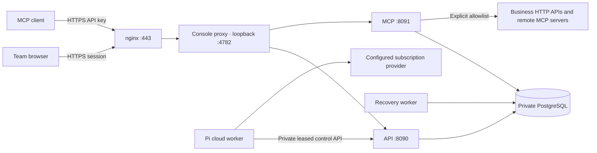

# Cloud deployment

## Product decision

Rillgate is delivered as an invitation-only cloud workspace for an owner and their team. The browser console, API, MCP endpoint and operation ledger run on the server. Local Compose and static identities are development facilities.

The deployment recipe uses one Linux host with Docker Compose, host nginx and PostgreSQL. This is a deliberately single-host topology: it supports a small team but does not provide high availability. Cloud hosting does not change the remaining product scope listed in [implementation status](implementation-status.md). This guide describes the current source and operator procedure. The governance/recovery packages were deployed as `20261005-cloud.8` from feature commit `05d1706780ce7f5c8a085a8801eb144be15c9631`; the dated [verification record](verification.md) separates confirmed deployment/API/browser/restore checks from remaining cloud mutation, rollback and external-destination coverage.



No database or backend port is published publicly. The cloud configuration runs the application as an unprivileged user with a read-only filesystem, CPU/memory/process limits and bounded Docker logs. A health failure is visible through Compose; restart policies restart exited processes, not merely unhealthy processes.

The public deployment is [https://rillgate.cn/](https://rillgate.cn/); its team workspace is [https://rillgate.cn/console/](https://rillgate.cn/console/) and MCP endpoint is `https://rillgate.cn/mcp`. The public website is served at `/`; the team workspace is served at `/console/`. Both share the existing HTTPS origin. New invitations point to `/console/#invite=...`; previously issued `/#invite=...` links are forwarded in the browser, keeping the token in the fragment. The website is a separate static entry and makes no account or gateway requests. The workspace continues to require authentication.

The public website has English (`/en/`) and Simplified Chinese (`/cn/`, HTML language `zh-CN`) entries. Both are complete static pages generated from one template and a typed copy dictionary, with localized metadata and alternate-language links. The root defaults to English and follows a valid saved language preference when JavaScript is available. Explicit language URLs take precedence and save the selection; switching retains the query and section anchor. Storage restrictions leave the native language links usable. Legacy invitation forwarding takes precedence over language selection. The workspace and repository documentation remain English.

## Identity and access

- One account belongs to one workspace. Usernames are globally unique, normalized to lowercase, and are not verified email addresses.
- The owner receives a one-time administrator invitation, valid for seven days after initial startup. Its hash is inserted only once; restarting or changing the configured bootstrap token does not reopen registration.
- Administrators create single-use invitations with an explicit role and 48-hour expiry. Links are shared manually. The invitation grants access to whoever possesses it; there is no email delivery or email identity verification.
- Passwords use bcrypt cost 12, with a 12–72 byte input limit. Browser sessions expire after 12 hours, are stored as hashes and use a Secure, HttpOnly, SameSite cookie with the `__Host-` prefix.
- Browser mutations require the configured Origin and a session-bound CSRF token. Sign-in and invitation acceptance also require that Origin. TLS termination must preserve the browser's Origin header.
- A user can create a personal API key, displayed once and stored only as a hash, valid for 30 days. It inherits the user's role and workspace. MCP requires an API key; browser cookies cannot authenticate MCP. API keys cannot manage accounts or mint other keys.
- Administrator browser sessions can create separate machine clients with `tools:read`/`tools:invoke` scopes and explicit tool/server grants. Creation/rotation returns a key once; list/update returns metadata only. Client disablement, expiry, key rotation and grant removal are checked live, including on saved operation snapshots. Machine clients cannot administer the workspace or approve writes. See the [client contract](remote-mcp-contract.md#machine-clients-and-live-permissions).
- Member disablement and role changes revoke existing sessions and keys. Access is checked in PostgreSQL on each request. Requests already admitted may complete. Re-enabling a member does not restore old credentials.
- Administrators cannot change their own access. Concurrent administrator changes are serialized and recheck the acting administrator to prevent removing all administrators through simultaneous requests.
- Password changes revoke all that user's sessions and keys. Logout revokes the current session. Account actions have their own durable audit events.

There is no self-service forgotten-password reset, MFA, enterprise SSO, group mapping or multi-workspace membership yet. Account recovery currently requires the deployment operator; do not claim email-based recovery or OIDC compliance.

### Account HTTP endpoints

All paths below start with `/api/v1/auth`. JSON input is limited to 8 KiB. The existing tool and operation APIs also accept cloud sessions or API keys, with their existing role checks.

| Method/path | Access | Input / behavior |
| --- | --- | --- |
| `GET /status` | Public | Returns `mode: cloud` or development `token`; cloud also includes a cookie-presence hint, not an authentication decision |
| `POST /login` | Public, matching Origin | `username`, `password`; sets session cookie |
| `POST /accept` | Public, matching Origin | `token`, `username`, `password`; consumes invitation atomically |
| `GET /session` | Browser session | Identity, username and CSRF token |
| `POST /logout` | Browser session + CSRF | Revokes current session |
| `POST /password` | Browser session + CSRF | `current`, `password`; revokes sessions and keys |
| `GET /members` | Administrator session | Up to 500 workspace members |
| `POST /members/{id}` | Administrator session + CSRF | `role`, `disabled`; revokes target's credentials |
| `GET /invites` | Administrator session | Latest 100 invitations without secrets |
| `POST /invites` | Administrator session + CSRF | `role`; returns one-time URL |
| `POST /invites/{id}/revoke` | Administrator session + CSRF | Revokes an unused invitation |
| `GET /keys` | Browser session | Latest 100 own key records without secrets |
| `POST /keys` | Browser session + CSRF | `name`; returns key once |
| `POST /keys/{id}/revoke` | Browser session + CSRF | Revokes an owned key |
| `GET /events` | Administrator session | Latest 100 workspace identity events |

## Host preparation and release

Follow the [delivery workflow](development.md#github-and-cloud-release-baseline) for review, commit tracking and rollback conditions. The operator invokes the checked release commands explicitly; there is no unattended promotion or high-availability rollout.

Use an independent release directory under `/opt/mcp-gateway/releases/<release>`. Transfer source without `.env`, `.local`, `.gateway`, model credentials or `node_modules`. Point `/opt/mcp-gateway/current` at that release. Backups and secrets live outside release directories.

Run as the deployment operator:

```sh
python3 scripts/cloud-bootstrap.py --origin https://YOUR_PUBLIC_IP --release YOUR_RELEASE
docker compose --env-file /opt/mcp-gateway/cloud.env -f deploy/compose/cloud.yaml build api console pi-runner
docker compose --env-file /opt/mcp-gateway/cloud.env -f deploy/compose/cloud.yaml up -d --no-build
```

The bootstrap script creates random credentials without printing them or overwriting existing values. It also preserves an existing `cloud.env`: `--release` alone does not update `RELEASE_ID`. Keep the selected commit, release directory, image tags, environment release ID and `current` symlink consistent during every upgrade. The bootstrap also creates `secrets/master-key` once: exactly 32 raw random bytes for AES-GCM downstream credentials. Cloud API/Gateway startup requires this key through `GATEWAY_MASTER_KEY_FILE`; never replace it to solve a startup error. The private `owner-setup.txt` contains the owner invitation. The application user can read only the mounted secret files; the environment file remains root-readable. The source archive and images contain no deployment credentials.

Migrations run as a required job before the services start. A failed migration prevents application startup. Back up before schema changes. An image rollback does not automatically reverse migrations; confirm backward compatibility before switching releases.

### Install operations tools independently

Keep operational scripts independent of the application `current` symlink so an application rollback cannot switch encrypted backups back to an older backup implementation or remove the monitor. From a reviewed source directory, run:

```sh
python3 scripts/cloud-install-ops.py install --source /path/to/reviewed-source --base /opt/mcp-gateway
```

The installer copies only the release/backup/monitor scripts in its fixed allowlist into `/opt/mcp-gateway/ops-releases/<version>` and atomically selects them through `/opt/mcp-gateway/ops`. If the source has `release.json`, the five script checksums must match that artifact manifest. Reinstalling identical content is a no-op; previous bundles remain available. It does not copy secrets/configuration, alter application release metadata, or enable a service/timer. Install the reviewed backup/monitor unit files separately; their entry points are `/opt/mcp-gateway/ops/backup.sh` and `/opt/mcp-gateway/ops/monitor.sh`.

`cloud-install-ops.py list --base /opt/mcp-gateway` lists retained bundles. If the operations tools themselves need rollback, use `restore --base /opt/mcp-gateway --version PREVIOUS_OPS_VERSION` with a version printed by the installer/list command. This is independent of application rollback. A pre-existing supported plain `ops` directory is preserved as a legacy bundle; if conversion is interrupted between directory preservation and symlink creation, use the retained bundle version with `restore`. Backup and collector scripts still select the application's database through `base/current/deploy/compose/cloud.yaml`; they do not embed a database credential.

A monitor installed before migrations 006–010 is not expected to read nonexistent tables: a schema-005 database reports `monitor_failed` explicitly, while encrypted backups continue to work. A normal application rollback preserves the upgraded database schema, so the independently installed collector remains usable. Do not treat an uninitialized-schema monitor failure as evidence of business failure or suppress it by inventing metrics.

### Upgrade an existing installation

Use `scripts/cloud-release.py package` on the development/review host to create an artifact from a full reviewed commit. Only committed files are included. The package manifest binds source and migration checksums; an archive or manifest alone is not an image signature. Transfer that artifact privately to the server without changing its contents.

A legacy installation must first match a committed artifact through `adopt --artifact /path/legacy.tar.gz --base /opt/mcp-gateway`. This is read-only unless `--record` is supplied. Recording stores the matched manifest, actual database migration checksums and observed image IDs. It does not establish historical build provenance.

Before a first release using encrypted backups, ensure bootstrap has created the vault master key, install GnuPG 2, and initialize/escrow the independent backup key described below. Then run:

```sh
python3 /opt/mcp-gateway/ops/cloud-release.py deploy --base /opt/mcp-gateway --artifact /path/reviewed-release.tar.gz
```

Deployment checks the current tuple, builds the named images, records a transition, stops API/Gateway/workers/console with a grace period, creates an encrypted pre-release snapshot, runs migrations, starts the selected images, checks service/image and public HTTPS health, and finalizes `cloud.env`/`current` plus release evidence. It preserves PostgreSQL and Pi volumes and existing secrets. This procedure has a maintenance window; it does not claim rolling deployment.

Keep prior release directories and image IDs. `rollback --release PREVIOUS_ID --base /opt/mcp-gateway` uses retained images and never reverses migrations. When the database includes additional migrations, rollback requires a reviewed `--compatibility` JSON naming the exact target release/commit and allowed extra migration checksums. Do not infer backward compatibility merely because startup succeeds.

`repair-metadata --base /opt/mcp-gateway` is limited to a previously verified transition interrupted while updating environment/pointer metadata. It rechecks source, schema, recorded images and health and does not alter services, database contents or secrets. It cannot turn an unverified failed deployment into success. Inspect failure state and use an explicit compatible rollback instead; the script deliberately avoids automatic database restoration.

Current new schema additions are `006_connections.sql`, `007_clients.sql`, `008_tool_versions.sql`, `009_observability.sql` and `010_capacity.sql`. Apply all checked migrations through the release job; never edit an already applied migration to bypass its checksum.


### HTTPS without a domain

Let’s Encrypt supports IP address certificates with the `shortlived` profile. Certbot 5.4 supports IP validation through webroot; see the [official instructions](https://letsencrypt.org/2026/03/11/shorter-certs-certbot). These certificates last approximately six days, so automatic renewal is required.

1. Serve `/var/www/mcp-gateway-acme/.well-known/acme-challenge/` on port 80. Permit inbound 80/443 and retain SSH access.
2. Request a staging certificate first with a separate certificate name. Once validation works, request the trusted certificate as `mcp-gateway-ip`:

```sh
docker run --rm \
  -v /etc/letsencrypt:/etc/letsencrypt \
  -v /var/lib/letsencrypt:/var/lib/letsencrypt \
  -v /var/log/letsencrypt:/var/log/letsencrypt \
  -v /var/www/mcp-gateway-acme:/var/www/mcp-gateway-acme \
  certbot/certbot:v5.4.0 certonly --non-interactive --agree-tos \
  --register-unsafely-without-email --preferred-profile shortlived \
  --webroot --webroot-path /var/www/mcp-gateway-acme \
  --ip-address YOUR_PUBLIC_IP --cert-name mcp-gateway-ip
```

3. Replace `PUBLIC_IP` in `deploy/cloud/nginx.conf.template` with the actual address; install it as the site's nginx configuration. Validate with `nginx -t`, then reload. The template enforces TLS, request bounds and IP-based auth/API throttles. The application also limits password verification concurrency and sign-in rate.
4. Install `deploy/cloud/mcp-gateway-certificate.{service,timer}` into `/etc/systemd/system/`, then enable the timer. The script renews and reloads nginx twice daily, and fails if fewer than 24 hours remain on the certificate. The old host Certbot package is not used by this recipe. Disable its timer if it also manages this certificate directory: overlapping clients can compete for Certbot’s lock, and older clients do not understand IP renewal.
5. Check a normal HTTPS request **without** disabling certificate validation. Check `systemctl list-timers` and run the service manually once. A successful initial certificate is not proof that future renewal will succeed; monitor the timer's result and certificate expiry.

Renewal failures currently surface through systemd/journald. External expiry monitoring and alert delivery remain operational work.

### Move to a registered domain

Use the apex domain as the canonical HTTPS origin. Point both its `@` and `www` A records to the host. Confirm authoritative/public resolution and remove any stale AAAA record pointing elsewhere before requesting the certificate. Keep the existing port-80 ACME webroot reachable.

1. Request a separate certificate using the existing ACME account. The existing IP certificate stays in place for the legacy HTTPS redirect:

```sh
docker run --rm \
  -v /etc/letsencrypt:/etc/letsencrypt \
  -v /var/lib/letsencrypt:/var/lib/letsencrypt \
  -v /var/log/letsencrypt:/var/log/letsencrypt \
  -v /var/www/mcp-gateway-acme:/var/www/mcp-gateway-acme \
  certbot/certbot:v5.4.0 certonly --non-interactive \
  --webroot --webroot-path /var/www/mcp-gateway-acme \
  --cert-name mcp-gateway-domain -d YOUR_DOMAIN -d www.YOUR_DOMAIN
```

2. Preserve root-readable copies of `cloud.env`, the nginx site and certificate service configuration on the same host. Replace `PUBLIC_DOMAIN` and `PUBLIC_IP` in `deploy/cloud/nginx-domain.conf.template`, then install it **instead of** the IP-only site. Run `nginx -t` before reload. The template serves the apex and redirects HTTP, `www` and the old HTTPS IP to the fixed canonical origin while preserving the request path/query. Port 80 continues to serve ACME challenges. Unknown HTTPS hosts are rejected.
3. Change only `PUBLIC_ORIGIN` in `cloud.env` to `https://YOUR_DOMAIN`. Recreate API, gateway and worker from their existing release images using Compose `up -d --no-build --no-deps --force-recreate --wait api gateway worker`. Preserve every other environment value and all volumes. This has a short maintenance window; in-flight operations need the same drain/recovery review as an application replacement.
4. Install `deploy/cloud/renew-domain-certificates.sh` as `/opt/mcp-gateway/edge/renew-domain-certificates.sh` (root-owned, mode 0755). Install `deploy/cloud/certificate-domain.override.conf` as `/etc/systemd/system/mcp-gateway-certificate.service.d/domain.conf`. Run `systemctl daemon-reload` and start the certificate service once. The existing twice-daily timer now checks both named certificates; unrelated host certificates are untouched. The script and override are host configuration outside application releases, so an application rollback does not disable domain renewal.
5. Run Certbot `renew --cert-name mcp-gateway-domain --dry-run` with the same Docker mounts to exercise the renewal challenge. A normal renewal invocation that reports “not due” does not test the challenge. Inspect the service/timer result and certificate expiry.
6. Verify HTTPS normally, without bypassing certificate validation: public and workspace pages, redirect path/query preservation, authentication/CSRF and MCP identity boundaries. Check host DNS too; public propagation does not clear a recursive resolver's negative cache.

Browser cookies are bound to a host: users sign in again at the domain using their existing accounts. Update MCP clients to `https://YOUR_DOMAIN/mcp` directly; do not rely on clients forwarding authorization across redirects. New invitation links use the updated origin. Old browser invitation URLs reach the new origin through the redirect and existing fragment forwarding; verify this with a synthetic token before distributing links.

If the configuration switch fails, restore the saved nginx site and `PUBLIC_ORIGIN`, validate/reload nginx, and recreate the same three services from their existing images. Restore/remove only the new certificate service override as appropriate. This is an origin/configuration rollback, not a database restore or application release rollback; keep both issued certificates for inspection.

## Backups and recovery

The backup tooling requires Python 3, GnuPG 2 and Docker Compose. Initialize a separate private backup passphrase before enabling the timer:

```sh
python3 /opt/mcp-gateway/ops/cloud-backup.py init-key --key /opt/mcp-gateway/backup-key
python3 /opt/mcp-gateway/ops/cloud-backup.py create --base /opt/mcp-gateway \
  --key /opt/mcp-gateway/backup-key --temp-dir /dev/shm --label manual-check
```

`init-key` never overwrites an existing file. Escrow this key independently; it must not be the vault master key or be stored in the backed-up `secrets` directory. The snapshot encrypts a custom-format PostgreSQL dump, `cloud.env` and the bounded secret directory (including the vault master key) in one GPG AES-256/MDC bundle. It validates decryption and entry checksums before atomically publishing the snapshot and `last-local.json` receipt. Temporary plaintext uses a private directory; the Linux recipe chooses `/dev/shm` so it is not written to persistent temporary storage. Allocate enough tmpfs space for the database dump and validation archive.

After installing the independent operations bundle, install `mcp-gateway-backup.{service,timer}` for the daily schedule. `backup.sh` defaults to **local-only encrypted backup**; optional settings are read from the host-owned `/opt/mcp-gateway/backup.env`. The service requires the backup key. Current tooling preserves previous snapshots and does not automatically prune them; plan and verify retention before deleting recovery material. A successful local receipt does not prove off-host protection.

### Explicit off-host destination

Automatic off-host transfer is not commissioned until an independent destination is supplied. Configure a restricted SSH account, pinned host key, identity file and an existing remote directory. The private off-host JSON has exactly these fields:

```json
{
  "host": "backup@example.net",
  "directory": "/srv/gateway-backups",
  "identity_file": "/root/.ssh/gateway_backup",
  "known_hosts_file": "/root/.ssh/known_hosts"
}
```

Set `GATEWAY_BACKUP_OFFHOST_CONFIG=/opt/mcp-gateway/backup-offhost.json` in `backup.env`. The timer then requests scheduled off-host mode. Transfers use strict SSH host-key verification and validate the remote SHA-256 before recording `last-offhost.json`; a failed transfer leaves the valid local and previous remote snapshots intact and returns failure. Do not set a placeholder destination merely to satisfy a readiness indicator. Keep backup-key escrow outside this host's failure domain.

### Restore verification

Use a completed encrypted snapshot and its independent key:

```sh
python3 /opt/mcp-gateway/ops/cloud-backup.py restore-verify \
  --snapshot /opt/mcp-gateway/backups/SELECTED_SNAPSHOT.tar.gpg \
  --key /opt/mcp-gateway/backup-key --temp-dir /dev/shm \
  --receipt /opt/mcp-gateway/backups/last-restore.json
```

The drill decrypts and checks the archive, restores into a disposable PostgreSQL 16 container with no published ports, network or production volumes, checks migrations/operation records and removes the container. It never restores over the live database or overwrites secrets. Run this on a suitable independent recovery host for disaster-recovery acceptance; a same-host isolated drill is useful evidence but does not cover host loss.

Pi configuration/session volumes, nginx and certificate state are outside this bundle and need coordinated private backup. Preserve the source/artifact and recovery procedure as well as the encrypted data. There is no point-in-time recovery, automatic production restore or high availability. No automatic off-host delivery has been verified until a second destination is configured and its receipt/restore evidence is recorded.

## Capacity, collection and alert delivery

Administrators manage per-workspace/client/upstream admission budgets and inspect aggregates in the console. REST admission failures return 429 with `Retry-After`; MCP tool failures carry `isError:true`, retry delay and scope. These controls bound new dispatch admission and do not cancel already admitted calls. See the [capacity contract](remote-mcp-contract.md#admission-controls-and-capacity-reporting).

`deploy/cloud/monitor.py` defaults to a fixed, bounded, read-only query through the selected cloud Compose PostgreSQL service. It gathers low-cardinality call/rejection metrics, unresolved UNKNOWN age and the local/off-host/restore receipts; no business payloads or credential values enter notifications. A latest `confirmed_success` or `confirmed_failure` reconciliation clears that operation from the overdue-UNKNOWN signal while its stored execution state remains `UNKNOWN`.

After installing the independent operations bundle, install `mcp-gateway-monitor.{service,timer}` to evaluate every minute. The host-owned `monitor.env` may set `GATEWAY_MONITOR_WORKSPACE`, `GATEWAY_MONITOR_RULES` and `GATEWAY_MONITOR_DELIVERY_CONFIG`. Example rule/config shapes are in `deploy/cloud/monitor-rules.example.json` and `monitor-delivery.example.json`.

Without delivery configuration, the collector prints local JSON with `delivery.status:local_only` and `sent:false`. A missing external destination must not be represented as a delivered alert. To enable delivery, supply:

```json
{
  "kind": "generic",
  "url_file": "/opt/mcp-gateway/monitor-webhook-url",
  "cooldown_seconds": 3600
}
```

`kind` accepts `generic`, `feishu` or `wecom`. The URL file must be an absolute private regular file with mode 0600 and a direct HTTPS webhook address. Keep the URL out of source control and logs. Cooldown is 60–86400 seconds. The monitor sends on the first incident, changed alert codes or cooldown expiry, and sends one recovery notification after clearing. It requires transport and, for Feishu/WeCom, provider acknowledgement before recording a successful send. Persistent delivery state suppresses routine repeats; a crash between remote acknowledgement and writing the local receipt can still cause a duplicate.

Exit codes are 0 for healthy, 2 for evaluated alerts (including successfully sent or local-only alerts), and 1 for delivery/configuration or execution failure. The systemd unit sets `SuccessExitStatus=2`, so a completed evaluation with an alert is not misclassified as a collector failure; the alert remains present in JSON/journald. This unit correction was separately verified on the live host without replacing the cloud.8 application images. Inspect JSON and the service result together. The collector does not replace independent certificate-expiry/host availability monitoring or a full metrics backend. External alert acceptance awaits the actual webhook configuration; fixture tests do not establish delivery to a real team channel.

## Cloud Agent worker

The `pi-runner` service polls the private Go API for durable tasks. It has a separate daemon secret, a fixed workspace binding, a persistent Pi configuration volume and a separate task/session volume. It receives no database password, bootstrap invitation, downstream credentials or Docker socket. Both nginx layers block `/internal/`; backend ports remain unpublished.

`RUNNER_WORKSPACE_ID` defaults to the owner's `team` workspace. This deployment provisions one worker for that workspace; adding an organization requires a separate scoped worker configuration and is not a self-service feature. Use a stable `RUNNER_WORKER_ID` and preserve its state volume across replacements. Current limits are one active task per worker and per creator, ten queued tasks per creator, five minutes per attempt, forty governed tool admissions per task, 64 KiB output and 1000 events per attempt.

A task's creator must remain an enabled administrator or operator. Model tools receive operator-level permissions and cannot approve their own actions. Cancellation fences new tool admissions; a previously dispatched business action can still complete and its operation record must be inspected. Expired leases become `NEEDS_REVIEW` and need explicit resumption. Pending approval, dispatch or uncertain outcome blocks resumption. See the [shared contract](cloud-run-contract.md) for state transitions and HTTP interfaces.

### Configure the server subscription

The Gateway and external MCP clients do not need a server model account. Browser Agent tasks require a separate Pi subscription login on this host. Deployment never copies a laptop login and the worker does not fall back to paid API keys. Missing configuration is reported in the console and claimed tasks enter `WAITING_CREDENTIALS`.

Use a trusted operator terminal on the deployment host:

```sh
docker compose --env-file /opt/mcp-gateway/cloud.env -f deploy/compose/cloud.yaml exec pi-runner \
  node node_modules/@earendil-works/pi-coding-agent/dist/cli.js
```

Complete Pi's interactive login and model selection in that terminal. The container sets `PI_CODING_AGENT_DIR=/var/lib/pi/config`; its named volume is private to the worker. Optional `PI_PROVIDER` / `PI_MODEL` settings in `cloud.env` override model selection. Stop the interactive Pi session after configuring it. The daemon picks up login/settings changes on its next polling cycle. Changes to `cloud.env` require recreating the worker (`docker compose ... up -d --force-recreate pi-runner`). Inspect its sanitized runtime status and explicitly resume a waiting task. Configuration readiness is not proof that the provider will accept inference or has remaining quota.

The console does not accept model passwords or subscription tokens. A self-service model-account connection UI and per-user model accounts remain future work. One configured server subscription supplies the team's tasks subject to the provider's applicable account conditions; do not claim per-user quota isolation.

### Worker recovery and backup

Preserve both `pi-config` and `pi-state` volumes. The PostgreSQL backup alone does not include Pi sessions or intent journals. Back up these volumes privately while the worker is stopped, together with the database and daemon secret, before disaster recovery. Restart never silently reconstructs a missing prior session or retries an uncertain write. Consult the runner guide before removing a stale lock or changing worker identity.

## Downstream onboarding

Downstream access initially denies all destinations. HTTP tools and remote MCP servers share the policy. Add exact origins and, if needed, explicit private CIDRs in `cloud.env`, then recreate API/Gateway to load that network policy. Use the managed credential UI/API for encrypted workspace/origin-bound header secrets; these rotations/disablements take effect on new attempts without restart. Static entries in `secrets/credentials.json` remain supported but require service replacement when changed. Never mount the Docker socket into the Gateway to reach local workloads.

### Register a remote MCP server

1. Confirm the upstream offers a **Streamable HTTP** endpoint with header credentials or no authentication. Upstream OAuth, legacy HTTP+SSE and local stdio execution are not implemented. Bounded SSE responses to the original Streamable HTTP POST are supported; standalone streams and resumption are disabled.
2. Add its exact origin to `HTTP_ALLOWED_ORIGINS` in the private `cloud.env`, merging with existing entries. The scheme and port are part of the origin. Private or loopback destinations also require an explicit `HTTP_ALLOWED_CIDRS` entry. DNS/dial checks still apply; redirects, metadata and link-local destinations remain blocked. Do not use a broad private-network allowance when an individual host or narrower network suffices.
3. After loading the network allowlist, create a managed credential in the administrator console with reference `WAREHOUSE_MCP`, exact origin `https://mcp.example.com` and the required header values. Keep these values out of tool definitions and model input. Alternatively, for an operator-managed static reference, add the following to the existing private credential array; the same workspace/reference cannot exist in both sources:

```json
{
  "workspace_id": "team",
  "ref": "WAREHOUSE_MCP",
  "origin": "https://mcp.example.com",
  "headers": {"Authorization": "Bearer <upstream-service-token>"}
}
```

4. Recreate both services when the deployment origin/CIDR policy or static file changed (managed secret rotation alone does not require this):

```sh
docker compose --env-file /opt/mcp-gateway/cloud.env -f /opt/mcp-gateway/current/deploy/compose/cloud.yaml up -d --no-build --force-recreate api gateway
```

5. In the administrator console, register a display name, unique lowercase namespace, endpoint such as `https://mcp.example.com/mcp`, credential reference `WAREHOUSE_MCP` and timeout. URLs cannot embed credentials, query strings or fragments. A registration validates policy but does not perform the discovery or import tools.
6. Run Check to inspect safe connection/definition stages and saved history. A successful check makes no business tool call. Then Discover the server, review the returned schemas, choose explicit `read` or `write` risk and an optional response policy, and import selected tools. The console defaults risk to `write`; upstream annotations do not authorize read access. New imports are disabled drafts and require a separate publish action.
7. Exercise a read and, when relevant, an independently approved write in the intended workspace. Inspect operation results and upstream business state. Disable the server to verify new preparation/approval/dispatch is gated and tools disappear from the Agent catalog. Published tools on other servers remain unaffected.

The registry stores only credential references. The adapter never forwards the caller's Gateway key or browser session to an upstream. Each attempt uses an isolated MCP session; credentials cannot override MCP negotiation/session headers. Managed headers are encrypted and resolve dynamically; static-file headers resolve from startup configuration. Neither implements upstream OAuth or automatic token refresh. Pi's subscription login remains a separate model-provider connection.

A server endpoint and namespace cannot be edited after creation. Imports pin the remote name and schema hash; a live schema change blocks execution until an administrator reviews and publishes a candidate with the current discovered contract. Candidate publication and rollback create a new version, preserve old snapshots and revalidate live compatibility; neither provides automatic schema synchronization or gradual traffic rollout. Server disablement preserves tool-local flags and recorded operations and cannot guarantee cancellation of admitted calls.

Administrators can register at most 100 servers per workspace. Discovery permits at most 1000 tools, 100 pages and 4 MiB cumulative upstream result bytes, with 1 MiB per protocol response and 64 KiB per schema. Registration and discovery are available without a model account. The configured timeout, 100–120000 ms with a 10000 ms default, covers the whole upstream attempt.

MCP response policies select object and array-element fields from structuredContent, regenerate text and enforce a final envelope limit of 1–128 KiB, default 64 KiB. Original structuredContent is validated against output_schema before projection. Valid string/null root pagination cursors survive selection. Use `/results/*/title` to retain a field in each array element, or `/results` to retain the complete array. Administrators can preview a supplied sample and revise a response policy with version checks; previously prepared operations retain their original snapshot. Text-only results cannot use field selection, and unsupported or oversized content is rejected. A write whose response cannot be confirmed or processed is retained as UNKNOWN and is never automatically resent. See the [remote MCP contract](remote-mcp-contract.md) for exact limits and local synthetic acceptance instructions.

Deployments must apply the checked migrations through `010_capacity.sql` before starting this source. Existing HTTP definitions do not need manual conversion. Preserve server/tool/version/client/operation/audit records together with the separately encrypted master key, credential/configuration files and allowlist. Database ciphertext alone cannot reconstruct upstream access; consult the recovery procedure above.

## Previous workloads

When repurposing an existing server, record container IDs, names and restart policies before stopping them. Disabling their restart policy prevents reboot from unexpectedly resuming them. Preserve volumes until data deletion is explicitly needed. Restore only selected containers and their recorded policies; their old published ports may conflict with the new service.
