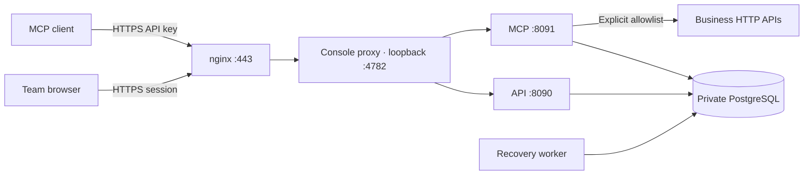

# Cloud deployment

## Product decision

MCP Gateway is delivered as an invitation-only cloud workspace for an owner and their team. The browser console, API, MCP endpoint and operation ledger run on the server. Local Compose and static identities are development facilities.

The current deployment uses one Linux host with Docker Compose, host nginx and PostgreSQL. This is a deliberately single-host topology: it supports a small team but does not provide high availability. Cloud hosting does not change the remaining product scope listed in [implementation status](implementation-status.md).



No database or backend port is published publicly. The cloud configuration runs the application as an unprivileged user with a read-only filesystem, CPU/memory/process limits and bounded Docker logs. A health failure is visible through Compose; restart policies restart exited processes, not merely unhealthy processes.

## Identity and access

- One account belongs to one workspace. Usernames are globally unique, normalized to lowercase, and are not verified email addresses.
- The owner receives a one-time administrator invitation, valid for seven days after initial startup. Its hash is inserted only once; restarting or changing the configured bootstrap token does not reopen registration.
- Administrators create single-use invitations with an explicit role and 48-hour expiry. Links are shared manually. The invitation grants access to whoever possesses it; there is no email delivery or email identity verification.
- Passwords use bcrypt cost 12, with a 12–72 byte input limit. Browser sessions expire after 12 hours, are stored as hashes and use a Secure, HttpOnly, SameSite cookie with the `__Host-` prefix.
- Browser mutations require the configured Origin and a session-bound CSRF token. Sign-in and invitation acceptance also require that Origin. TLS termination must preserve the browser's Origin header.
- A user can create a personal API key, displayed once and stored only as a hash, valid for 30 days. It inherits the user's role and workspace. MCP requires an API key; browser cookies cannot authenticate MCP. API keys cannot manage accounts or mint other keys.
- Member disablement and role changes revoke existing sessions and keys. Access is checked in PostgreSQL on each request. Requests already admitted may complete. Re-enabling a member does not restore old credentials.
- Administrators cannot change their own access. Concurrent administrator changes are serialized and recheck the acting administrator to prevent removing all administrators through simultaneous requests.
- Password changes revoke all that user's sessions and keys. Logout revokes the current session. Account actions have their own durable audit events.

There is no self-service forgotten-password reset, MFA, enterprise SSO, group mapping or multi-workspace membership yet. Account recovery currently requires the deployment operator; do not claim email-based recovery or OIDC compliance.

### Account HTTP endpoints

All paths below start with `/api/v1/auth`. JSON input is limited to 8 KiB. The existing tool and operation APIs also accept cloud sessions or API keys, with their existing role checks.

| Method/path | Access | Input / behavior |
| --- | --- | --- |
| `GET /status` | Public | Returns `mode: cloud` or development `token`; cloud also includes a cookie-presence hint, not an authentication decision |
| `POST /login` | Public, matching Origin | `username`, `password`; sets session cookie |
| `POST /accept` | Public, matching Origin | `token`, `username`, `password`; consumes invitation atomically |
| `GET /session` | Browser session | Identity, username and CSRF token |
| `POST /logout` | Browser session + CSRF | Revokes current session |
| `POST /password` | Browser session + CSRF | `current`, `password`; revokes sessions and keys |
| `GET /members` | Administrator session | Up to 500 workspace members |
| `POST /members/{id}` | Administrator session + CSRF | `role`, `disabled`; revokes target's credentials |
| `GET /invites` | Administrator session | Latest 100 invitations without secrets |
| `POST /invites` | Administrator session + CSRF | `role`; returns one-time URL |
| `POST /invites/{id}/revoke` | Administrator session + CSRF | Revokes an unused invitation |
| `GET /keys` | Browser session | Latest 100 own key records without secrets |
| `POST /keys` | Browser session + CSRF | `name`; returns key once |
| `POST /keys/{id}/revoke` | Browser session + CSRF | Revokes an owned key |
| `GET /events` | Administrator session | Latest 100 workspace identity events |

## Host preparation and release

Use an independent release directory under `/opt/mcp-gateway/releases/<release>`. Transfer source without `.env`, `.local`, `.gateway`, model credentials or `node_modules`. Point `/opt/mcp-gateway/current` at that release. Backups and secrets live outside release directories.

Run as the deployment operator:

```sh
python3 scripts/cloud-bootstrap.py --origin https://YOUR_PUBLIC_IP --release YOUR_RELEASE
docker compose --env-file /opt/mcp-gateway/cloud.env -f deploy/compose/cloud.yaml build api console
docker compose --env-file /opt/mcp-gateway/cloud.env -f deploy/compose/cloud.yaml up -d --no-build
```

The bootstrap script creates random credentials without printing them or overwriting existing values. The private `owner-setup.txt` contains the owner invitation. The application user can read only the mounted secret files; the environment file remains root-readable. The source archive and images contain no deployment credentials.

Migrations run as a required job before the services start. A failed migration prevents application startup. Back up before schema changes. An image rollback does not automatically reverse migrations; confirm backward compatibility before switching releases.

### HTTPS without a domain

Let’s Encrypt supports IP address certificates with the `shortlived` profile. Certbot 5.4 supports IP validation through webroot; see the [official instructions](https://letsencrypt.org/2026/03/11/shorter-certs-certbot). These certificates last approximately six days, so automatic renewal is required.

1. Serve `/var/www/mcp-gateway-acme/.well-known/acme-challenge/` on port 80. Permit inbound 80/443 and retain SSH access.
2. Request a staging certificate first with a separate certificate name. Once validation works, request the trusted certificate as `mcp-gateway-ip`:

```sh
docker run --rm \
  -v /etc/letsencrypt:/etc/letsencrypt \
  -v /var/lib/letsencrypt:/var/lib/letsencrypt \
  -v /var/log/letsencrypt:/var/log/letsencrypt \
  -v /var/www/mcp-gateway-acme:/var/www/mcp-gateway-acme \
  certbot/certbot:v5.4.0 certonly --non-interactive --agree-tos \
  --register-unsafely-without-email --preferred-profile shortlived \
  --webroot --webroot-path /var/www/mcp-gateway-acme \
  --ip-address YOUR_PUBLIC_IP --cert-name mcp-gateway-ip
```

3. Replace `PUBLIC_IP` in `deploy/cloud/nginx.conf.template` with the actual address; install it as the site's nginx configuration. Validate with `nginx -t`, then reload. The template enforces TLS, request bounds and IP-based auth/API throttles. The application also limits password verification concurrency and sign-in rate.
4. Install `deploy/cloud/mcp-gateway-certificate.{service,timer}` into `/etc/systemd/system/`, then enable the timer. The script renews and reloads nginx twice daily, and fails if fewer than 24 hours remain on the certificate. The old host Certbot package is not used by this recipe. Disable its timer if it also manages this certificate directory: overlapping clients can compete for Certbot’s lock, and older clients do not understand IP renewal.
5. Check a normal HTTPS request **without** disabling certificate validation. Check `systemctl list-timers` and run the service manually once. A successful initial certificate is not proof that future renewal will succeed; monitor the timer's result and certificate expiry.

Renewal failures currently surface through systemd/journald. External expiry monitoring and alert delivery remain operational work. Registering a domain later changes `PUBLIC_ORIGIN`, nginx and certificate provisioning; existing sessions remain valid only under the new cookie origin and old invitation URLs need replacement.

## Backups and recovery

Install and enable `mcp-gateway-backup.{service,timer}`. It writes a custom-format PostgreSQL dump daily to `/opt/mcp-gateway/backups`, validates its catalog, writes atomically and retains approximately seven days. Permissions are private; overlapping backups are locked out.

Validate restoration into a **separate empty database**, inspect restored tables and only then consider a production restore. Never restore over the running database as a health check. Preserve `cloud.env`, the secret directory, nginx configuration and certificate state separately.

The local dump protects against an application mistake but shares the server's failure domain. Off-host encrypted backup and an external restore target are still required for disaster recovery. There is no point-in-time recovery configured.

## Model access and downstream onboarding

The cloud Gateway itself does not need a model account. External MCP clients authenticate using their personal Gateway key. The existing Pi CLI remains a development/integration client; a cloud Pi task worker, model connection management and durable Agent Runs are still pending.

No personal model login is copied to the server automatically. Browser-based Agent execution must not be advertised as available until the cloud runner and credential flow are implemented and verified.

Downstream access initially denies all destinations. Add exact origins and, if needed, explicit private CIDRs in `cloud.env`; place workspace-bound downstream credentials in `secrets/credentials.json`. Recreate the API and Gateway after a configuration change. Never mount the Docker socket into the Gateway to reach local workloads.

## Previous workloads

When repurposing an existing server, record container IDs, names and restart policies before stopping them. Disabling their restart policy prevents reboot from unexpectedly resuming them. Preserve volumes until data deletion is explicitly needed. Restore only selected containers and their recorded policies; their old published ports may conflict with the new service.
