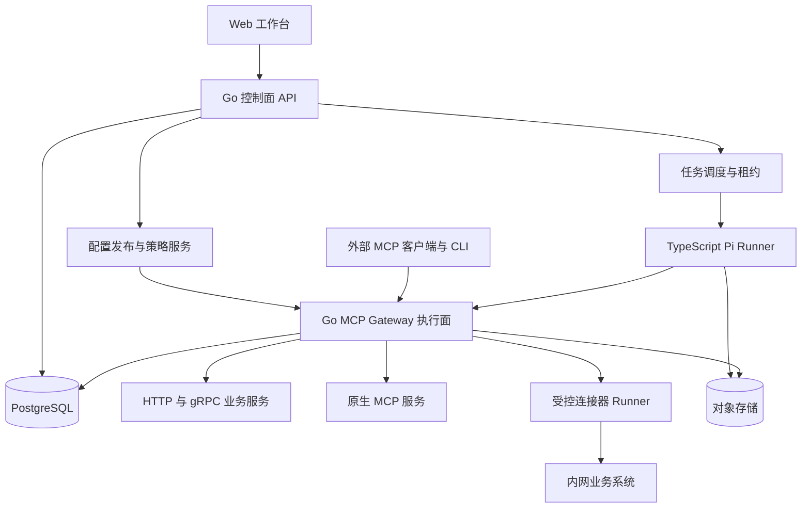

# Rillgate 项目功能与架构设计

更新日期：2026-10-06

本文定义 Rillgate 的完整产品范围、系统架构和生产验收要求，是开发、测试和部署的共同依据。文中功能和指标均为建设目标，不代表现有代码已经实现或达到这些指标。

近期开发按 [网关开发方案](gateway-roadmap.md) 执行，主线为“接入工具 → 授权给 Agent → Agent 搜索并调用”。下文保留长期范围；首个完整版本只交付网关核心。独立客户端、内置 Agent 任务工作台扩展、多 Agent 编排和模型账号管理均不在此次交付范围内。

服务与模块边界、事务、跨进程契约和部署结构见 [系统架构设计](architecture.md)。

## 当前网关核心源码边界

下文保留长期目标，当前实现和发布验收按以下边界理解：

- 产品入口是现有 MCP 客户端，管理端组织服务与工具、访问密钥和调用记录；不依赖 Pi 任务，暂不扩展 Agent 工作台或多 Agent 编排。
- 网关对外提供七个工具：`search_tools`、`get_tool_schema`、`call_tool`、`get_operation`、`read_result`，以及兼容的 `prepare_action`、`invoke_tool`。Pi 联调客户端保留既有五工具接口。
- `search_tools` 支持 MCP `server_id` 过滤和明确的词法排序理由；权限在分页与计数前过滤，摘要与完整 schema 分开加载。不包含环境过滤、向量检索或自动中文分词。
- `call_tool` 在一次调用中组织准备和 READY 执行。审批策略为管理员版本化发布的 `required` / `none`；旧写工具要求审批，策略放宽不自动释放已有待审批操作，执行前重查最新权限与策略，UNKNOWN 写入不重放。
- 大结果只支持 MCP 的对象 structuredContent，先校验和投影，再按显式策略返回引用。投影后 envelope 上限 1 MiB，TTL 60–86400 秒，工作空间上限 100 MiB / 1000 份。PostgreSQL 存储 JSON，`read_result` 按权限、有效期和字节游标读取；不是通用文件存储或模型压缩。
- 自动重试只适用于 HTTP 只读 GET 的部分临时连接错误与 502/503/504，最多两次、共用原期限；进程内熔断不跨实例共享。MCP、Connector 和写操作均不自动重放。
- Go CI 对声明文件逐文件检查至少 90% 语句覆盖；前端 TypeScript 逻辑采用聚合 95% 行、90% 分支/函数门槛，TSX 不包含在内。不能据此声称全仓或 UI 覆盖达标。

当前源码需要单独的准确版本 CI、外部客户端与云端验收。真实 OAuth 供应商授权尚未由本地协议测试证明，单机部署不宣称高可用。源码状态见 [实现状态](implementation-status.md)，历史证据见 [验证记录](verification.md)。

## 1 产品定位

Rillgate 是面向企业研发、平台和业务团队的工具接入与治理平台。它将现有 HTTP API、gRPC 服务和 MCP Server 统一登记、授权和调用，通过标准 MCP 接口供用户已有的 Agent 客户端使用。

本次交付围绕外部 Agent 通过标准 MCP 接口使用企业工具；Web 控制台负责服务、访问密钥和调用记录管理。已有 Pi 任务能力仅保留兼容维护，任务平台扩展属于后续可选方向。网关核心服务独立于模型运行，模型不可用时，已获授权的普通工具调用仍可执行。

完整产品包括工具接入、目录检索、权限治理、版本发布、执行可靠性、任务管理、人工审批、审计观测、评测和生产运维。功能围绕“把已有系统可靠地提供给 Agent 使用”展开。

## 2 用户与业务场景

| 角色 | 主要操作 |
| --- | --- |
| 组织管理员 | 创建工作空间、管理成员、身份源、配额和组织策略 |
| 工具负责人 | 接入服务、维护工具定义、配置权限、提交发布与回滚 |
| Agent 开发者 | 绑定工具集合、模型连接和 Skill，配置任务策略、运行评测 |
| 业务使用者 | 发起任务、补充信息、查看证据、确认获授权的操作 |
| 审批人与审计员 | 审批变更或业务动作，查看审计记录和异常执行 |
| 平台运维人员 | 管理部署、Runner、告警、备份、容量和故障恢复 |

核心场景包括数据任务调查与重试、服务异常调查、业务指标查询与报告，以及跨系统状态核对。查询和写入均通过受控工具完成；允许操作的对象、环境和动作由工具策略明确约束。

主线验收使用外部 MCP 客户端完成服务接入、工具发布授权、按需发现和只读调用，并查看结果与运行记录。数据任务调查与重试作为扩展场景：Agent 查询任务与日志，提出有依据的判断；写操作按照服务端工具策略执行，要求审批时由审批人确认参数后继续。业务结果核对按适配器能力独立验证。

## 3 产品组织与权限

资源按组织、工作空间、项目和环境组织。工具可以在组织内发布为共享目录，但每个工作空间必须显式获得访问授权；测试与生产环境分别绑定连接器和凭据。

用户通过 OIDC 单点登录进入平台，支持组织邀请、成员停用和角色管理；自动化调用使用受限服务身份。服务端从可信身份上下文解析租户，所有列表、搜索、对象下载、事件订阅和执行接口都校验资源归属。

权限采用角色与资源属性组合判断，属性至少包括调用人、Agent、工作空间、项目、环境、工具、动作和资源范围。实际权限是调用人授权、Agent 授权、工具策略与下游授权的交集；审批不能扩大任一主体原有权限。

工具负责人、发布审批人和运行时审批人是不同职责，可由组织策略要求分离。管理员的配置权限不自动包含查看原始敏感业务数据的权限。

## 4 完整功能

### 4.1 服务与工具接入

- HTTP 接入支持 OpenAPI 导入和表单配置，定义方法、路径、参数、响应结构、认证、分页、超时和错误映射。
- gRPC 接入支持导入 Protobuf 描述文件，明确方法与消息映射；无损处理枚举、可选值和大整数。流式方法通过显式适配器定义读取边界，不能自动当成普通查询工具。
- MCP 接入支持远程 Streamable HTTP，以及在受控 Runner 中托管的 stdio 服务。配置协议版本、能力、身份、健康检查和可调用工具集合。
- 导入时检查定义完整性、命名冲突、引用深度和响应大小；定义外的动态地址、请求头和环境变量不允许由模型任意填写。
- 接入后执行连通性检查与受限试调用，记录负责团队和数据分类。自动发现的工具进入待审核状态，审核前不能被 Agent 调用。
- 工具必须描述业务目的、参数含义、返回结果、副作用、风险级别、幂等支持和适用场景。LLM 可辅助生成说明，发布前由负责人确认。

接入任务定期同步已授权的接口定义和 MCP 工具列表，识别新增、删除和 Schema 变化，生成待审差异，不直接覆盖线上版本。连接器报告健康、最近成功同步时间和定义来源；数据过期与服务不可用分别展示。

### 4.2 工具目录与按需发现

目录支持分类、标签、关键词、语义检索、负责人、环境和健康状态过滤。工具使用稳定 ID 标识，显示名称可以变化；同名工具通过服务命名空间区分。

Agent 可以检索服务、查看候选工具摘要、读取指定版本的参数结构，再发起调用。检索结果在召回、排序和返回各环节执行权限过滤，不能泄露未授权工具名称、描述或示例。

检索返回工具与配置版本，调用时重新校验权限、启用状态和版本可用性。目录缓存的存在不构成调用授权，紧急禁用与撤权优先于已固定的任务版本。

缓存键包含组织、工作空间、身份授权范围、环境和配置版本。目录变更、权限撤销和凭据解绑触发失效；调用结果仅在工具明确声明可缓存、且隔离键覆盖全部业务条件时缓存。

### 4.3 配置发布与回滚

服务地址、参数映射、说明、认证引用、风险级别和执行策略组成不可变的配置版本。发布流程为编辑、校验、差异审查、审批、部署与生效确认。

工具支持停用、弃用和替代版本提示。影响参数或语义的变更需要兼容性检查及绑定任务的回归评测；回滚生成新的发布记录，保留原有执行历史。

网关实例按配置修订号加载完整快照，再原子切换内存视图。请求固定一个配置快照；所有实例的生效进度可查。涉及权限或凭据撤销的变更单独广播，缓存超过允许的新鲜度后拒绝敏感调用。

### 4.4 统一执行与结果管理

调用链统一执行身份认证、资源授权、参数校验、配额检查、审批校验、下游调用、结果校验、脱敏和审计。工具可配置并发、速率、时间、结果大小及运行预算。

结果可以按字段投影，支持分页和文件产物。投影用于减少网关返回与存储的内容及上下文占用；网关收到上游结果后进行裁剪，不减少上游传输量，字段访问控制仍单独执行；原始结果是否允许存储由数据策略决定。

对大型结果，返回摘要和有权限约束的产物引用，Agent 按需读取。CLI 与 MCP 使用相同执行链和身份策略，命令行参数采用结构化解析；CLI 不提供绕过审批、直接拼接任意 Shell 的通道。

协议错误、参数错误、权限拒绝、业务失败、下游不可用和执行结果未知分别编码。HTTP 成功不自动等于业务成功；只有适配器明确的成功条件满足后，才能标记业务动作成功。

### 4.5 Agent 任务工作台

用户可以创建、查看、取消和恢复任务，补充输入，处理审批，比较执行结果。任务支持手动触发、定时计划和签名 Webhook；事件去重、时区和并发策略在计划配置中明确。

Agent 配置包括任务说明、模型连接、允许的工具版本、Skill 版本、输入输出结构、停止条件和预算。任务开始后固定这些配置，并记录每次必要的模型切换。

Pi 负责阶段内分析与工具选择。平台负责任务与阶段状态、模型连接、工具授权、证据、终态校验和恢复。子 Agent 使用独立会话与受限任务包，继承权限上限；并发和深度由服务端限制。

结果页面提供结论、依据、执行动作、业务结果和未解决事项。缺少证据时允许返回无法确定，禁止将工具异常或未执行的操作解释为完成。

### 4.6 审批与处置

源码中运行时审批已由管理员发布的服务端工具策略决定，工具上线审查与每次操作审批分别配置。旧写工具缺省要求独立审批，既有工具不会自动转为免审批；非法策略拒绝放行。策略管理、迁移与执行时核验要求见 [开发方案](gateway-roadmap.md#4-审批策略的调整边界)。以下审批流程适用于策略要求审批的操作。

审批页面展示真实工具版本、完整业务参数、目标环境、影响对象、预期结果及有效期。批准记录绑定任务、调用人、Agent、参数摘要哈希、策略版本和单次操作 ID。

执行前重新检查身份和目标状态；参数改变、授权过期、环境改变或策略收紧后必须重新审批。审批采用原子领取，避免重复消费；重试查询同一业务操作的结果，不生成新的授权。

拒绝、过期和撤销均是可观察状态。需要长期审批的任务释放 Worker 租约，批准后重新排队。取消只停止尚未开始的动作；已生效的动作通过独立补偿任务处理。

### 4.7 评测与运营

提供任务数据集、工具沙箱、录制结果回放、候选版本与基线比较，以及发布门禁。回放运行必须隔离真实写入，不能向生产服务重新发送录制的动作。

看板展示任务完成率、工具选择准确性、权限拒绝、人工介入、响应时间、上下文用量和资源消耗。模型账单金额仅在供应商提供可核验价格或费用数据时显示；订阅模式分别展示请求、token 和配额状态。

## 5 可视化操作端

| 页面 | 主要内容 |
| --- | --- |
| 工作台总览 | 任务、待审批、服务健康、调用与费用趋势 |
| 服务接入 | 导入配置、连接检查、凭据引用、环境映射 |
| 工具目录 | 搜索、参数、示例、权限、负责人和版本 |
| 工具发布 | 差异、兼容性结果、评测、审批、生效和回滚 |
| Agent 配置 | 模型连接、工具集合、Skill、预算及输出要求 |
| 任务详情 | 阶段、事件时间线、工具参数、结果、证据和恢复操作 |
| 审批中心 | 参数与影响、审批理由、有效期及执行结果 |
| 调用审计 | 主体、授权依据、配置版本、下游结果、Trace 和导出 |
| 评测中心 | 数据集、评分规则、基线比较和失败样本 |
| 组织与运维 | 成员、配额、Runner、告警、存储和保留策略 |

所有长任务支持刷新页面后恢复查看、明确的等待原因和断线重连。界面仅展示用户有权看到的操作与数据；权限仍在服务端校验。

## 6 系统架构

| 组件 | 技术与职责 |
| --- | --- |
| Web 工作台 | React 与 TypeScript，提供管理、任务和审计操作 |
| 控制面 | Go，身份、资源、配置、审批、任务 API 和评测管理 |
| 执行面 | Go，MCP 接口、适配器、授权、限流、调用与结果处理 |
| Agent Runner | Node.js LTS、TypeScript、Pi SDK，管理受控会话和模型连接 |
| 连接器 Runner | 运行内网适配器、stdio 服务和受限命令，通过出站连接接收任务 |
| 元数据存储 | PostgreSQL，保存配置、任务、调用、审批、事件和审计索引 |
| 产物存储 | S3 兼容对象存储，保存加密证据、报告和会话快照 |
| 调度与缓存 | PostgreSQL 租约与事务 Outbox；Redis 用于限流和短期缓存 |
| 观测 | OpenTelemetry、Prometheus 及兼容日志平台 |

控制面、执行面和 Runner 分别扩容。PostgreSQL 是业务事实源；Redis 或通知丢失不能导致任务丢失，Worker 定期对账未完成工作。

Pi SDK 的会话、工具和资源加载由宿主显式配置。Runner 使用受控资源加载器，不能自动信任被分析仓库中的扩展或启动脚本。MCP 与按需工具加载按锁定的 Pi 版本显式接入，不能假设 SDK 与 CLI 的默认能力相同。[Pi SDK](https://pi.dev/docs/latest/sdk)

## 7 任务与调用的可靠性

任务状态包括 `QUEUED`、`RUNNING`、`WAITING_INPUT`、`WAITING_APPROVAL`、`WAITING_CREDENTIALS`、`RECOVERING`、`CANCELLING`、`SUCCEEDED`、`FAILED`、`CANCELLED`。状态转换和原因持久化；等待状态不长期占用 Worker。

Worker 获取带期限和递增 fencing token 的租约，通过心跳续约。失去租约的 Worker 不能继续写入任务结果；新 Worker 恢复前核对未完成工具调用。fencing token 只保护平台写入，外部副作用还需要下游幂等或结果核对。

模型流、工具结果和业务状态分开存储。只有模型已结束、工具调用均已核对、输出符合任务契约时，任务服务才写入终态。Pi 的会话持久化用于恢复模型上下文，业务恢复由平台状态机负责。

工具发送前先持久化操作 ID、规范化参数哈希、授权与调用意图，再向下游发起请求。结果证据上传并校验后，事务提交结果引用和调用状态；进程在任一步骤中断都可依据操作记录对账。组织、Agent 和任务预算在执行前原子预留，结束后结算，避免并发任务共同突破上限。

| 调用情形 | 处理规则 |
| --- | --- |
| 只读查询暂时失败 | 在总超时和预算内指数退避重试，尊重下游限流 |
| 写操作支持幂等 | 复用同一业务操作 ID 与参数哈希；参数冲突拒绝执行 |
| 写操作响应丢失 | 标记 `UNKNOWN`，通过下游操作 ID 查询或人工核对 |
| 下游无幂等也无法查询 | 停止自动重试，进入人工处置 |
| Agent 或 Worker 崩溃 | 从已提交阶段与调用记录恢复，避免重复发送未知写操作 |
| 用户取消或达到预算 | 停止新调用并尝试终止在途操作，保留已经发生的结果 |
| 凭据过期 | 进入等待凭据状态，恢复后重新鉴权，不自动扩大权限 |

任务状态、事件与 Outbox 在同一数据库事务中提交。事件带单调递增序号，浏览器从最后序号续读；慢客户端通过背压和断线续传处理，不能无限堆积内存。

工具调用采用至少一次调度、业务幂等与结果核对的语义，不承诺任意外部系统的端到端恰好一次执行。审批记录、调用记录和证据完整性不足时，任务不能报告成功。

## 8 核心数据与接口

| 数据对象 | 关键内容 |
| --- | --- |
| Organization、Workspace、Project、Environment | 资源层级、成员、策略和数据归属 |
| Service、Connection、CredentialRef | 目标地址、网络边界、身份引用和健康状态 |
| Tool、ToolVersion、Release | 稳定工具 ID、Schema、映射、策略与发布修订号 |
| AgentDefinition、AgentVersion | Prompt、Skill、模型连接、工具集合和预算 |
| Run、Stage、Lease | 任务状态、输入快照、阶段、恢复点和 fencing token |
| ToolInvocation、Operation | 参数哈希、幂等键、下游 ID、重试及未知结果 |
| Approval、Grant | 审批主体、绑定范围、有效期和消费状态 |
| RunEvent、AuditEvent、Outbox | 执行事件、操作审计与可靠投递 |
| Artifact、Evaluation | 证据哈希、权限、数据集、评分和版本比较 |

所有业务记录带组织及工作空间归属，关联关系使用同租户约束。任务创建幂等键按工作空间唯一；工具操作幂等键按租户、目标服务和业务操作范围唯一；审批消费和阶段提交使用条件更新。

对外接口分为三类：

- **管理 REST API**：服务、工具、发布、Agent、成员、策略、审批和评测管理，提供 OpenAPI 契约。
- **任务 API**：`POST /v1/runs` 创建任务；`GET /v1/runs/{id}` 查询；`GET /v1/runs/{id}/events` 订阅；取消、恢复和审批使用独立动作接口。
- **MCP 接口**：工作空间和服务级 MCP 端点，提供获授权的工具发现与调用；长业务任务通过任务 API 和显式任务工具查询，避免将浏览器事件流与 MCP 传输混为一谈。

每个发布版本列出实际支持的 MCP 协议修订、传输和能力。参考规范为 2026-07-28；旧修订的握手、会话和取消语义通过兼容适配层处理。未实现的资源、提示词或交互能力不宣称支持；不支持的版本明确拒绝。[MCP 传输规范](https://modelcontextprotocol.io/specification/2026-07-28/basic/transports)

## 9 身份与凭据保护

远程 MCP 接口作为受保护资源校验令牌的签发方、受众、有效期和权限。网关身份与下游身份分别管理，通过受控凭据代理或令牌交换获取下游凭据，不透传无关受众的令牌。[MCP 授权规范](https://modelcontextprotocol.io/specification/2026-07-28/basic/authorization)

凭据以密钥系统引用存储，运行时短期注入对应进程。日志、工具说明、模型上下文和浏览器接口不返回凭据。连接器 URL、重定向、DNS 解析和网络出口都受策略约束；内部网段按组织显式授权，云元数据地址默认封禁。

外部连接使用 TLS，浏览器会话配置安全 Cookie、CSRF 防护和严格的跨域来源。Runner 注册绑定组织和工作空间，使用短期工作凭据，通过出站连接获取任务；停用 Runner 后拒绝续租并撤销其执行权限。

用户托管的 Pi Runner 可以使用本机已配置的订阅账号连接；个人登录文件保留在该 Runner 环境。集中无人值守部署绑定支持相应使用方式的组织模型连接，同样通过 Pi 访问。连接失效时任务可恢复等待，不能静默改用付费连接或借用其他用户身份。

Runner 以最小权限运行，限制文件、网络、CPU、内存、进程数量和执行时间。执行 Shell 或托管 stdio 服务时使用隔离环境；平台不向普通 Runner 暴露宿主 Docker socket。

数据库权限过滤与行级策略共同保护租户隔离；对象下载使用短期授权，并在签发前重新检查归属。工具响应按字段分类、脱敏和大小限制处理，提示词注入内容不能修改平台授权。

默认保留运行元数据与脱敏证据 90 天、调用审计 365 天；原始敏感响应默认不落盘。组织可在明确告知和容量约束下调整。删除覆盖数据库、对象、检索索引及到期备份；需要保留的审计记录采用脱敏标识，不继续保留被删除的业务正文。

## 10 部署与生产运行

提供完整容器镜像、Docker Compose 私有部署和 Kubernetes 部署清单。Compose 适用于容量明确的专用环境，其单机故障边界写入部署说明；高可用部署使用多实例控制面与网关、分散调度的 Runner、具备故障切换能力的 PostgreSQL 和对象存储。

网关在控制面暂时不可用时可使用有效的已签名配置快照。认证、撤权或审计持久化无法满足要求时，拒绝敏感操作；普通查询的降级行为必须由策略明确声明，不能默认放行。

发布包含镜像签名、依赖清单、配置兼容检查和数据库迁移。迁移采用先兼容再切换的方式；执行中的任务继续绑定原版本，紧急安全撤销除外。回滚必须同时验证应用、Schema 和工具配置兼容性。

数据库采用连续日志归档与定期备份，对象存储启用版本及生命周期管理；恢复需要核对数据库引用和对象哈希。恢复演练包括整库恢复、单租户数据找回和凭据失效后的重连。

监控覆盖 API、队列等待、租约丢失、未知写入、权限拒绝、下游故障、证据写入、配置滞后和模型配额。Trace 关联任务与工具调用，指标标签使用低基数维度；业务参数和令牌不进入指标标签。

每类告警提供责任人和处置手册。未知写入、租户越权、配置撤销不生效、数据库与证据不一致需要明确的停止执行和恢复步骤。

## 11 质量目标与验收

下列数值是生产验收目标，测试报告必须记录硬件、拓扑、工具数量、负载、数据量和版本，不得将目标值写成已取得的结果。

| 维度 | 验收要求 |
| --- | --- |
| 服务可用性 | 控制面与执行面有效请求的月度可用性目标 99.9%；下游故障和模型可用性单独统计 |
| 基础容量 | 在 50 个工作空间、100 个服务、2000 个工具目录下，验证 100 RPS 普通工具请求和 20 个并发 Agent 任务 |
| 网关开销 | 在上述负载、1 KB 请求及 10 KB 响应条件下，剔除下游时间后网关 p95 附加延迟不超过 100 ms |
| 配置生效 | 普通配置 30 秒内收敛；撤权与紧急禁用 5 秒内生效，超出新鲜度的实例拒绝敏感调用 |
| 故障恢复 | Worker 丢失后 60 秒内开始接管或进入明确等待状态；不自动重放未知写入 |
| 备份恢复 | RPO 不超过 5 分钟，RTO 不超过 60 分钟；以包含对象存储的演练记录验收 |
| 隔离与审批 | 全部越权、跨租户、参数替换、审批重放和撤权用例通过，无已知绕过路径 |
| 证据完整性 | 正式任务的工具调用、审批和结果均能关联到配置版本及证据；缺失时阻止成功终态 |

Agent 评测使用独立保留的业务任务集，覆盖正常、歧义、拒绝、失败、审批和未知结果。比较固定模型与预算下的工具全量注入、按需发现及结果投影，报告任务成功率、工具选择、token、耗时和人工介入。压缩上下文不能以降低授权正确性或掩盖失败为代价。

发布门禁包含单元与契约测试、MCP 兼容测试、端到端业务测试、租户隔离测试、故障注入、负载测试、依赖检查和备份演练。评测质量阈值随具名数据集与任务类型版本化，发布前人工批准，不能只用模型自评决定上线。

## 12 项目交付与参考

完整交付包含前后端与 Runner 源码、接口和数据迁移、部署配置、权限矩阵、连接器开发规范、评测集与报告、监控告警、升级回滚和恢复手册。接入文档说明支持范围、错误语义和下游幂等要求；GitHub 项目介绍按实际验收结果描述能力。

架构参考 Uber 对工具接入、控制面与执行面、工具发现的公开设计；本文的模块、状态机、技术选型和验收目标是本项目的独立设计，不代表 Uber 内部实现，也不代表取得其代码或品牌授权。[Uber MCP Gateway](https://www.uber.com/jp/en/blog/designing-mcp-gateway/)

Vuler 通过标准 MCP 和版本化接口选择性集成本项目，双方不共享业务库。相关文档：[Vuler 项目设计](../../vuler/docs/product-design.md)、[项目入口](../../README.md)。
