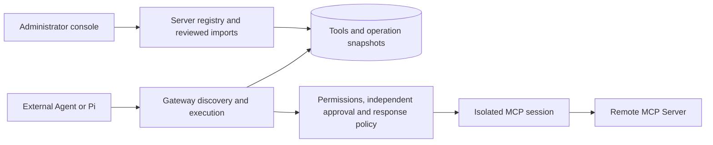

# Remote MCP integration

This document describes the implemented remote MCP adapter and its management contract. The [OpenAPI document](../api/openapi.yaml) defines HTTP request and response shapes; [implementation status](implementation-status.md) tracks the remaining product work.

## Connection and execution model

An administrator registers an upstream server, discovers its tools and imports selected contracts as disabled drafts. Publishing makes an imported tool available through the existing Gateway discovery and execution interfaces. External agents and Pi use the same five governed Gateway tools; importing a server does not expose its full API directly to a model.



The adapter uses the official MCP Go SDK. Every discovery or execution attempt creates its own upstream session and closes it afterward. It does not pool sessions across users or forward the caller's Gateway bearer token, browser cookie or request headers.

### Supported protocol scope

- **Transport:** remote Streamable HTTP. Responses to the original POST can be JSON or SSE. Standalone GET streams, stream resumption and reconnect/replay are disabled. This does not provide the legacy HTTP+SSE transport.
- **Capabilities:** initialization, complete paginated `tools/list` discovery and one reviewed `tools/call` per execution session. Resource, prompt, sampling, elicitation and task APIs are not proxied or advertised as Gateway capabilities.
- **Authentication:** operator-configured static credential references with headers such as `Authorization`. There is no upstream OAuth discovery, dynamic client registration, interactive authorization or refresh-token lifecycle. The Pi model subscription is separate from upstream MCP authentication.
- **Results:** text content and optional structured JSON. Image, audio, resource and other content blocks are rejected. A tool requiring unsupported interaction does not become successful merely because it returned an MCP response.
- **Processes:** the cloud Gateway does not launch local stdio servers. A private-network Connector and isolated stdio execution remain planned.

A valid implementation of other MCP features is not necessarily compatible with this intentionally limited adapter. Review the server's transport, authentication and output requirements before onboarding it.

## Server registry and administrative workflow

All `/api/v1/mcp/servers` endpoints require an administrator in the authenticated workspace. Browser mutations additionally require the existing Origin and CSRF protections. Resource IDs cannot select a different workspace.

| Method and path | Behavior |
| --- | --- |
| `GET /api/v1/mcp/servers` | Complete list `{items,total}`, including disabled servers; at most 100 per workspace |
| `POST /api/v1/mcp/servers` | Register an enabled server with immutable endpoint, namespace and credential reference |
| `POST /api/v1/mcp/servers/{id}/enabled` | Set `{enabled:true\|false}` without changing imported tool definitions |
| `POST /api/v1/mcp/servers/{id}/discover` | Send `{}`; read the current complete bounded upstream catalog |
| `POST /api/v1/mcp/servers/{id}/import` | Verify a selected live contract and create a disabled draft, or return the identical existing import |

Registration accepts:

```json
{
  "name": "Warehouse MCP",
  "namespace": "warehouse",
  "url": "https://mcp.example.com/mcp",
  "credential_ref": "WAREHOUSE_MCP",
  "timeout_ms": 10000
}
```

`name` is trimmed and limited to 120 UTF-8 bytes. `namespace` is required, workspace-unique and matches `^[a-z][a-z0-9_-]{0,23}$`. URLs are limited to 2048 bytes and cannot contain embedded credentials, a query string or a fragment. The timeout defaults to 10000 ms and is bounded to 100–120000 ms for the complete discovery or execution attempt, including handshake and contract verification. Registration checks configuration; discovery performs the network connection.

Discovery returns `{items,total}`. Each item includes the remote `name`, description, input/output schemas, advisory `read_only_hint`, canonical `schema_hash`, stable `gateway_name`, and optional existing `imported_tool_id`. Gateway aliases combine the namespace, a sanitized/truncated remote name and an eight-character hash of its full name, with a maximum length of 64 bytes. An alias collision is rejected by the registry rather than routed to another tool.

Import requires an explicit risk decision:

```json
{
  "tool_name": "inventory",
  "schema_hash": "<exact hash returned by discovery>",
  "risk": "read",
  "response_policy": {
    "include": ["/source", "/items"],
    "max_bytes": 4096
  }
}
```

The console starts risk selection at `write`. The remote read-only annotation is a hint, not an authorization rule. An administrator can explicitly select `read` after reviewing the tool. Every write operation continues to require approval by a different person.

Import repeats live discovery before saving the tool. A new import is `draft`, `enabled:false`, `version:1`. Publish it separately with the existing `POST /api/v1/tools/{id}/publish` action. Direct HTTP tool registration cannot be used to inject an MCP configuration and bypass the import check.

Repeating the same server/tool import with the same schema hash, risk and normalized response policy returns the existing tool. It does not reset its publication state. A different hash, risk or policy returns `409`, preserving the original tool and all prepared operations. Discovery never updates imports automatically.

## Contract changes and disablement

The schema hash covers the remote name and canonical input/output JSON schemas; whitespace and object-key order do not create a different contract. Descriptions and annotations are not execution authority. Each operation snapshot retains the imported MCP server ID, remote name, schema hash, risk and response policy.

Immediately before a business call, the adapter performs discovery again and compares the live contract with both the imported hash and the persisted schemas. A removed or changed contract fails before `tools/call`. There is no in-place import upgrade, version rollout or rollback yet; a changed contract requires a separately reviewed registration until the version lifecycle is implemented.

Disabling a server:

- Removes its tools from the model-facing catalog and non-admin registry results, including subsequent pages of an existing search.
- Leaves administrative diagnostics visible with effective `enabled:false`; independent tool flags are retained.
- Blocks new preparations, approvals and dispatch admission, including previously prepared `READY` operations, and blocks publication or enabling of its tools.
- Blocks new upstream discovery and imports.
- Does not guarantee cancellation of an already admitted downstream call or erase its operation history.

Re-enabling the server restores only tools whose own state remains published and enabled. A separately disabled tool stays disabled.

## Result validation and field selection

For an imported MCP tool, `output_schema` validates the original upstream **`structuredContent`**, before redaction and projection. It does not describe the stored result envelope or the selected object. A response missing required structured content or failing that schema cannot become `SUCCEEDED`.

Successful results are stored as an MCP envelope with `isError:false`, `content` and optional `structuredContent`. A configured selection also adds `gateway_projection` metadata. The management Tool response exposes `mcp` and `response_policy`; its `http` field is an unused empty serialization placeholder. The MCP platform's `get_tool_schema` additionally reports `result_format: mcp_call_tool_result` to explain this envelope.

A response policy has two independent limits:

| Field | Contract |
| --- | --- |
| `include` | Up to 32 JSON Pointer-style selectors with an array traversal extension; absent/empty includes all structured fields after common-secret redaction |
| `max_bytes` | Final serialized UTF-8 envelope size; default 65536, accepted range 1024–131072; omitted or zero normalizes to the default |

Selectors are at most 256 UTF-8 bytes each and use JSON Pointer `~0` and `~1` escapes. A full `*` segment traverses every element of an array: `/results/*/title` and `/results/*/url` retain those two fields in each result. This wildcard is a Gateway extension, not part of RFC 6901. `/order/id` selects a nested field and `/items` selects an entire array. Numeric object keys are allowed; `/items/0/id` cannot index an array.

Array projection merges selected fields within each element, preserving order and cardinality. Nested and empty arrays are supported, and a selected leaf may be null. A missing field, object wildcard, numeric array index, or null/scalar intermediate node fails the complete result, even if other elements are valid. Empty path segments, NUL, partial or final `*`, duplicate paths, ancestor/descendant overlaps and conflicting array/object traversal at a shared node are rejected. Use `/items` to retain an entire array instead of `/items/*`.

Common secret-named structured fields are redacted recursively before selection. Root `nextCursor` and `next_cursor` are preserved during selection only when their values are strings or null; other types fail rather than allowing an unselected object through the cursor exception. When structured content exists, text is regenerated from the resulting object. Original text cannot bypass field selection or structured-field redaction. Text-only results support the size limit, but reject nonempty `include`.

The final byte limit includes the envelope, regenerated text and projection metadata. Oversized data is rejected, never truncated into invalid JSON. Projection reduces what is stored and sent to the model; it does not reduce the upstream response or network transfer. There is no large-result artifact store or deferred result-fetch API yet. Secret-name filtering is a baseline safeguard, not comprehensive sensitive-data detection; arbitrary text is not guaranteed to be secret-free.

## Policy editing and sample preview

Administrators can revise an imported tool's response policy from its console detail view, including after publication. The two endpoints are scoped to the authenticated workspace and accept MCP tools only:

| Method and path | Behavior |
| --- | --- |
| `POST /api/v1/tools/{id}/response-policy/preview` | Validate and project a supplied sample without calling the upstream or persisting the sample |
| `POST /api/v1/tools/{id}/response-policy` | Save a normalized policy with optimistic version checking |

Save request:

```json
{
  "expected_version": 1,
  "response_policy": {
    "include": ["/results/*/title", "/results/*/contentUrl"],
    "max_bytes": 65536
  }
}
```

An actual change returns the Tool at version 2 and records the previous/new versions and policies in `TOOL_RESPONSE_POLICY_UPDATED`. An identical policy at the current version is a no-op. A stale `expected_version` always returns `409`; the console preserves the draft and requires reloading the current tool before saving again. Risk, schema, upstream binding, publication and independent enablement remain unchanged. Policy repair is allowed while a server is disabled; it does not enable that server or tool.

Newly prepared operations capture the new version. Previously prepared or approved operations retain their exact prior policy and version. Live disablement and upstream schema-drift gates still apply at dispatch. This is response policy revision, not a general schema upgrade or release rollout mechanism.

Preview takes the same fields plus `sample`, a successful MCP envelope with explicit `isError:false`, a text-only `content` array and optional object `structuredContent`. If an output schema exists, the original structured sample must satisfy it before projection. The total request, including sample and policy, must fit within the management API's 256 KiB body limit. Unsafe JavaScript numbers are rejected by the browser editor; direct API clients preserve large JSON integers.

Preview returns `{tool_version,original_bytes,projected_bytes,result}`. Byte counts use Go's serialized UTF-8 envelope, after unsupported sample metadata is removed to match the live adapter. Final size includes regenerated text and projection metadata and can exceed the input size for small samples. These are sample byte counts, not token savings or upstream network measurements. No preview sample is stored in operations or audit records. A successful preview validates that sample only; future responses can still fail schema, field or size checks.

## Bounds and failure semantics

| Boundary | Limit |
| --- | --- |
| Registered upstream servers | 100 per workspace; overflow is rejected, never silently truncated |
| Complete discovery | 1000 tools, 100 upstream pages and 4 MiB cumulative upstream result bytes |
| Individual protocol response | 1 MiB, including bounded SSE/error response reads |
| Remote tool name / description | 128 / 4000 UTF-8 bytes |
| Input and output schema | 64 KiB each, locally compilable; input root must be an object; external references are disabled |
| Gateway catalog | Separate database keyset pages, maximum 50 summaries or definitions; upstream discovery is not automatically inserted into model context |
| Governed result envelope | Default 64 KiB, configurable from 1 to 128 KiB |

Duplicate tool names, invalid definitions, repeated cursors, unsupported schemas and excess bounds fail the complete discovery attempt. Management discovery JSON can be larger than the raw upstream budget after normalized metadata and JSON encoding are added, but it remains bounded by the table above. One unsupported definition currently rejects the whole discovery; there is no partial-import quarantine flow.

Before `tools/call`, a configuration, connection or schema-validation failure is `FAILED`. Once the call is attempted, timeout, malformed response, upstream tool error, unsupported interaction/content, output-schema failure or response-policy failure becomes `UNKNOWN` for writes and `FAILED` for reads. `UNKNOWN` requires checking the business outcome before any new action. A returned tool error does not prove that a write made no changes.

The transport prevents a second `tools/call` within the same execution session and disables SDK resumption/retry paths. The database claim prevents another dispatch of the recorded operation. This is not an exactly-once guarantee in the upstream business system, and no generic upstream idempotency support is claimed. New sessions repeat initialization and discovery on each execution; caching, connection pooling and background schema synchronization remain future work.

## Network and credential controls

Remote MCP uses the existing static downstream egress policy:

- `HTTP_ALLOWED_ORIGINS` lists exact scheme/hostname/port origins; no wildcard origin is implied.
- Private, loopback and carrier-grade NAT addresses additionally require an explicit `HTTP_ALLOWED_CIDRS` entry. Metadata, link-local, multicast and unspecified destinations remain blocked.
- DNS answers are checked and dialing uses the validated address. Redirects are not followed, and proxy environment variables are not inherited.
- `GATEWAY_CREDENTIALS_FILE` contains operator-managed credentials scoped to both workspace and exact origin. A server stores only its reference. Configured credentials cannot override transport/idempotency headers or MCP negotiation/session headers.
- API and Gateway processes load this configuration at startup. Changing a database server record does not add an allowed network destination; changing an allowlist or credential file requires recreating both services.

See [cloud onboarding](cloud-deployment.md#downstream-onboarding) for the hosted deployment. An administrator's ability to register a URL does not grant new network access.

## Local synthetic acceptance server

`test/mcp-fixture` is a loopback-only test server with no credentials, external integrations or persistent business data. It serves one tool per discovery page to exercise upstream pagination. Run each command from the repository root in its own terminal:

```sh
go run ./test/mcp-fixture -addr 127.0.0.1:8361 -label warehouse-a
```

```sh
go run ./test/mcp-fixture -addr 127.0.0.1:8362 -label warehouse-b
```

For Gateway processes running directly on the same host, merge these values into the local `.env` before restarting with `make dev`:

```dotenv
HTTP_ALLOWED_ORIGINS=http://127.0.0.1:8361,http://127.0.0.1:8362
HTTP_ALLOWED_CIDRS=127.0.0.1/32
```

Register endpoints `http://127.0.0.1:8361/mcp` and `http://127.0.0.1:8362/mcp` using distinct namespaces such as `warehouse_a` and `warehouse_b`, with no credential reference. Discover both, import and publish selected tools:

- `inventory`: import with explicit risk `read` and pointers `/source`, `/items`. The large internal note is omitted, the correct source distinguishes the servers and `next_cursor` is retained.
- `create_ticket`: keep risk `write`, prepare `{"title":"Acceptance check"}`, approve with a different identity and execute once. It increments only an in-memory synthetic counter.
- Read `/stats` on each fixture to inspect its independent write count; repeat execution of the same operation must not increment it again.
- Disable one server and verify its published tools disappear while the other server's tools remain available.

These loopback addresses are for source development. Inside a container, `127.0.0.1` points to that container. Do not widen the fixture listener or the cloud allowlist to make it a public service. The fixture validates Gateway behavior and does not substitute for compatibility acceptance against an actual third-party deployment.
