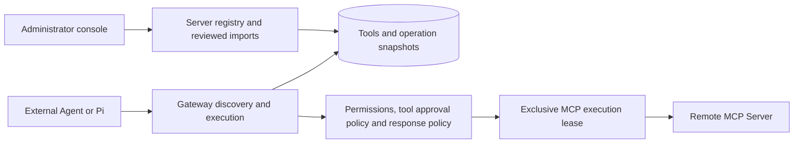

# Remote MCP integration

This document describes the implemented remote MCP adapter and its management contract. The [OpenAPI document](../api/openapi.yaml) defines HTTP request and response shapes; [implementation status](implementation-status.md) tracks the remaining product work.

## Connection and execution model

An administrator registers an upstream server, discovers its tools and imports selected contracts as disabled drafts. Publishing makes an imported tool available through the existing Gateway discovery and execution interfaces. External MCP clients use seven governed Gateway tools: `search_tools`, `get_tool_schema`, `call_tool`, `get_operation`, `read_result`, `prepare_action` and `invoke_tool`. The optional Pi runner retains its existing five-tool preparation/execution interface. Importing a server does not expose its full API directly to a model.



The adapter uses the official MCP Go SDK. Discovery and diagnostics use independent sessions. Execution can reuse a bounded session exclusively within the same actor/client-key/server/credential scope; no active session is shared between operations. It never forwards the caller's Gateway bearer token, browser cookie or request headers. See [execution sessions](mcp-sessions.md) for configuration, live checks and release acceptance.

Connection diagnostics compare two independent complete catalogs when the first catalog is compatible, using the original timeout. `session_contract_status` distinguishes observed stability, changed contracts and incomplete verification; historical reports and Connectors are explicitly not checked for this property. This adds a diagnostic observation, not session reuse or permission to ignore schema drift. See the [compatibility matrix and check contract](mcp-compatibility.md).

### Supported protocol scope

- **Transport:** remote Streamable HTTP. Responses to the original POST can be JSON or SSE. Standalone GET streams, stream resumption and reconnect/replay are disabled. This does not provide the legacy HTTP+SSE transport.
- **Capabilities:** initialization, complete paginated `tools/list` discovery and one reviewed `tools/call` per exclusive operation lease. Resource, prompt, sampling, elicitation and task APIs are not proxied or advertised as Gateway capabilities.
- **Authentication:** workspace/origin-bound credential references with headers such as `Authorization`. References can use a deployment file or the encrypted managed credential store. Alternatively, [upstream OAuth](upstream-oauth.md) supports metadata discovery, interactive authorization and refresh for pre-registered clients with PKCE S256 and RFC 9207 issuer responses. Static credentials and OAuth cannot be combined. Dynamic registration and client ID metadata documents remain unsupported. The Pi model subscription is separate from upstream MCP authentication.
- **Results:** text content and optional structured JSON. Image, audio, resource and other content blocks are rejected. A tool requiring unsupported interaction does not become successful merely because it returned an MCP response.
- **Processes:** the cloud Gateway does not launch stdio servers. An [outbound Connector](private-connectors.md) executes locally configured private HTTP or isolated Linux rootless-Podman stdio targets.

A valid implementation of other MCP features is not necessarily compatible with this intentionally limited adapter. Review the server's transport, authentication and output requirements before onboarding it.

## Server registry and administrative workflow

All `/api/v1/mcp/servers` endpoints require an administrator in the authenticated workspace. Browser mutations additionally require the existing Origin and CSRF protections. Resource IDs cannot select a different workspace.

| Method and path | Behavior |
| --- | --- |
| `GET /api/v1/mcp/servers` | Complete list `{items,total}`, including disabled servers; at most 100 per workspace |
| `POST /api/v1/mcp/servers` | Register an enabled server with immutable endpoint, namespace and credential reference |
| `POST /api/v1/mcp/servers/{id}/enabled` | Set `{enabled:true\|false}` without changing imported tool definitions |
| `POST /api/v1/mcp/servers/{id}/discover` | Send `{}`; read the current complete bounded upstream catalog |
| `POST /api/v1/mcp/servers/{id}/import` | Verify a selected live contract and create a disabled draft, or return the identical existing import |
| `POST /api/v1/mcp/servers/{id}/check` | Send `{}`; check connection and definitions without calling a business tool, and persist a safe diagnostic report |
| `GET /api/v1/mcp/servers/{id}/checks` | Read check history with `limit` (default 20, maximum 50) and exclusive `before` ID |

Registration accepts:

```json
{
  "name": "Warehouse MCP",
  "namespace": "warehouse",
  "url": "https://mcp.example.com/mcp",
  "credential_ref": "WAREHOUSE_MCP",
  "timeout_ms": 10000
}
```

`name` is trimmed and limited to 120 UTF-8 bytes. `namespace` is required, workspace-unique and matches `^[a-z][a-z0-9_-]{0,23}$`. URLs are limited to 2048 bytes and cannot contain embedded credentials, a query string or a fragment. The timeout defaults to 10000 ms and is bounded to 100–120000 ms for the complete discovery or execution attempt, including handshake and contract verification. Registration checks configuration; discovery performs the network connection.

Discovery returns `{items,total}`. Each item includes the remote `name`, description, input/output schemas, advisory `read_only_hint`, canonical `schema_hash`, stable `gateway_name`, and optional existing `imported_tool_id`. Gateway aliases combine the namespace, a sanitized/truncated remote name and an eight-character hash of its full name, with a maximum length of 64 bytes. An alias collision is rejected by the registry rather than routed to another tool.

Import requires an explicit risk decision:

```json
{
  "tool_name": "inventory",
  "schema_hash": "<exact hash returned by discovery>",
  "risk": "read",
  "response_policy": {
    "include": ["/source", "/items"],
    "max_bytes": 4096
  }
}
```

The console starts risk selection at `write`. The remote read-only annotation is a hint, not an authorization rule. An administrator can explicitly select `read` after reviewing the tool. Legacy and newly imported writes default to approval by a different person. An administrator can explicitly publish an approval exemption using the versioned policy endpoint; risk remains `write`. A read tool can also require approval. No calling client or model can choose its approval policy.

Import repeats live discovery before saving the tool. A new import is `draft`, `enabled:false`, `version:1`. Publish it separately with the existing `POST /api/v1/tools/{id}/publish` action. Direct HTTP tool registration cannot be used to inject an MCP configuration and bypass the import check.

Repeating the same server/tool import with the same schema hash, risk and normalized response policy returns the existing tool. It does not reset its publication state. A different hash, risk or policy returns `409`, preserving the original tool and all prepared operations. Discovery never updates imports automatically.

## Contract changes and disablement

The schema hash covers the remote name and canonical input/output JSON schemas; whitespace and object-key order do not create a different contract. Descriptions and annotations are not execution authority. Each operation snapshot retains the imported MCP server ID, remote name, schema hash, risk and response policy.

Immediately before a business call, the adapter performs discovery again and compares the live contract with both the snapshot hash and its persisted schemas. A removed or changed contract fails before `tools/call`. Administrators can review and publish contract changes through candidates; discovery does not silently refresh active definitions.

### Reviewed versions and retirement

| Method and path | Behavior |
| --- | --- |
| `GET /api/v1/tools/{id}/versions` | Immutable definition history, newest version first; `limit` defaults to 20 (maximum 100), `before` is the exclusive version cursor |
| `GET /api/v1/tools/{id}/candidates` | Unpublished candidates, at most 100 per tool |
| `POST /api/v1/tools/{id}/candidates` | Create a candidate using `expected_version` and a required review reason |
| `GET /api/v1/tools/{id}/candidates/{candidate}` | Read the candidate definition and field-level changes |
| `POST /api/v1/tools/{id}/candidates/{candidate}/publish` | Revalidate the live target, check `expected_version`, publish the next version and enable the tool |
| `POST /api/v1/tools/{id}/candidates/{candidate}/discard` | Discard an unpublished candidate with `{}` |
| `POST /api/v1/tools/{id}/retire` | Check `expected_version`, record the next version and set `retired`, `enabled:false` |

An MCP candidate can select a server/tool binding and explicit risk or response policy. Its schemas and hash come from live discovery, not a client-supplied hash. An HTTP candidate supplies a complete replacement HTTP definition. Alternatively, `source_version` copies a historical definition into a rollback candidate; it cannot be combined with overrides. The Gateway tool name remains stable. Candidate creation and publication both validate current network, credential and upstream compatibility.

Publication locks the active tool and candidate; a concurrent version change produces `409`, requiring a new review. A rollback publishes a new version and cannot restore an upstream contract that is no longer supported. Previously prepared or approved operations retain their original full snapshots. They still pass current permission, enablement and snapshot schema checks before dispatch. Retirement blocks new admission and preserves history. Restoring a retired tool requires a newly reviewed candidate, rather than the original draft publish action. There is no percentage rollout or automatic canary promotion.

Disabling a server:

- Removes its tools from the model-facing catalog and non-admin registry results, including subsequent pages of an existing search.
- Leaves administrative diagnostics visible with effective `enabled:false`; independent tool flags are retained.
- Blocks new preparations, approvals and dispatch admission, including previously prepared `READY` operations, and blocks publication or enabling of its tools.
- Blocks new upstream discovery and imports.
- Does not guarantee cancellation of an already admitted downstream call or erase its operation history.

Re-enabling the server restores only tools whose own state remains published and enabled. A separately disabled tool stays disabled.

## Result validation and field selection

For an imported MCP tool, `output_schema` validates the original upstream **`structuredContent`**, before redaction and projection. It does not describe the stored result envelope or the selected object. A response missing required structured content or failing that schema cannot become `SUCCEEDED`.

Inline successful results are stored as an MCP envelope with `isError:false`, `content` and optional `structuredContent`. A configured selection also adds `gateway_projection` metadata. The management Tool response exposes `mcp` and `response_policy`; its `http` field is an unused empty serialization placeholder. The MCP platform's `get_tool_schema` additionally reports `result_format: mcp_call_tool_result` to explain this envelope.

A response policy defines selection, inline size and optional artifact retention:

| Field | Contract |
| --- | --- |
| `include` | Up to 32 JSON Pointer-style selectors with an array traversal extension; absent/empty includes all structured fields after common-secret redaction |
| `max_bytes` | Inline serialized UTF-8 envelope limit; default 65536, accepted range 1024–131072; omitted or zero normalizes to the default |
| `artifact` | Optional explicit `{max_bytes, ttl_seconds}`; requires object structuredContent. Complete projected envelope limit defaults to 524288 and must be between the inline limit and 1048576. TTL defaults to 3600, accepted range 60–86400 seconds |

Selectors are at most 256 UTF-8 bytes each and use JSON Pointer `~0` and `~1` escapes. A full `*` segment traverses every element of an array: `/results/*/title` and `/results/*/url` retain those two fields in each result. This wildcard is a Gateway extension, not part of RFC 6901. `/order/id` selects a nested field and `/items` selects an entire array. Numeric object keys are allowed; `/items/0/id` cannot index an array.

Array projection merges selected fields within each element, preserving order and cardinality. Nested and empty arrays are supported, and a selected leaf may be null. A missing field, object wildcard, numeric array index, or null/scalar intermediate node fails the complete result, even if other elements are valid. Empty path segments, NUL, partial or final `*`, duplicate paths, ancestor/descendant overlaps and conflicting array/object traversal at a shared node are rejected. Use `/items` to retain an entire array instead of `/items/*`.

Common secret-named structured fields are redacted recursively before selection. Root `nextCursor` and `next_cursor` are preserved during selection only when their values are strings or null; other types fail rather than allowing an unselected object through the cursor exception. When structured content exists, text is regenerated from the resulting object. Original text cannot bypass field selection or structured-field redaction. Text-only results support the size limit, but reject nonempty `include`.

The final byte limit includes the envelope, regenerated text and projection metadata. Without artifact opt-in, an oversized envelope is rejected. With opt-in, an envelope above the inline limit but within the artifact limit is stored as a bounded reference and separately retained structured JSON; above the artifact limit it is rejected. Data is never truncated into invalid JSON. Projection reduces what is stored and sent to the model; it does not reduce the upstream response or network transfer. Secret-name filtering is a baseline safeguard, not comprehensive sensitive-data detection; arbitrary text is not guaranteed to be secret-free.

## Large structured-result references

Artifact retention is opt-in per MCP tool response policy and is copied into each operation snapshot. Only projected/redacted `structuredContent` is retained separately; duplicated text is not stored in the operation or event. The operation result becomes:

```json
{
  "gateway_result_ref": {
    "operation_id": "operation-id",
    "bytes": 12000,
    "sha256": "64-lowercase-hex-characters",
    "expires_at": "2030-01-01T01:00:00Z",
    "format": "json_utf8"
  },
  "message": "Read the projected structured JSON with read_result using operation_id; concatenate chunks before parsing. The reference is not the tool output schema."
}
```

The reference object is gateway metadata, not an MCP `CallToolResult` envelope or an instance of the upstream output schema. Fetch chunks with MCP `read_result` or `GET /api/v1/operations/{id}/result`, supplying optional `cursor` and `limit_bytes`. The chunk budget is 1024–16384 bytes (default 8192); the last chunk may be shorter and multibyte UTF-8 characters are not split. A response contains `operation_id`, `bytes`, `sha256`, `expires_at`, `format`, `offset`, `chunk` and optional `next_cursor`. Concatenate in byte-offset order before JSON parsing to retain exact numeric representations.

Each read independently checks workspace/operation ownership, current client grants/key, published/enabled tool, current and snapshot server/Connector availability, and expiry. An unsigned position cursor binds operation ID, digest and byte offset; it grants no access. Expired/denied artifacts are unavailable even before background cleanup deletes their payloads.

Quota is 100 MiB and 1000 retained artifacts per workspace, serialized transactionally. Retention shares the operation completion transaction. Quota exhaustion records FAILED for a read or UNKNOWN for a write whose business call already occurred, without storing a partial result; metrics use that durable outcome. Maintenance removes bounded batches of expired payloads. This is a PostgreSQL JSON store, not arbitrary file uploads, general HTTP-result compaction, model-generated summaries or external object storage.

## Invocation and approval policy

`call_tool` (REST `POST /api/v1/call`) accepts `tool_id`, object `arguments` and an 8–128-byte stable `idempotency_key`. It persists the intent and executes only if READY. It returns a WAITING_APPROVAL or recorded terminal/UNKNOWN operation unchanged. Repeating the same intent after approval can proceed; changing arguments or tool under the same key is a conflict. `prepare_action` and `invoke_tool` remain compatible explicit steps. `get_operation` inspects the recorded state.

Administrators use `POST /api/v1/tools/{id}/approval-policy` with `expected_version` and `approval_policy: required | none`. Changes increment the immutable tool version and append an audit record. Read/write risk classification is preserved. Legacy missing policies default to none for reads and required for writes; invalid nonempty values fail closed. Previously pending operations keep their approval requirement even if policy is relaxed. Dispatch checks both the operation snapshot and latest policy; a changed write version invalidates an unapproved exemption. Existing parameter/version-bound approvals and their 30-minute expiry remain enforced. Definition revisions preserve current policy, and risk reclassification restores the default; rolling back a definition does not silently reintroduce an old exemption.

## Policy editing and sample preview

Administrators can revise an imported tool's response policy from its console detail view, including after publication. The two endpoints are scoped to the authenticated workspace and accept MCP tools only:

| Method and path | Behavior |
| --- | --- |
| `POST /api/v1/tools/{id}/response-policy/preview` | Validate and project a supplied sample without calling the upstream or persisting the sample |
| `POST /api/v1/tools/{id}/response-policy` | Save a normalized policy with optimistic version checking |

Save request:

```json
{
  "expected_version": 1,
  "response_policy": {
    "include": ["/results/*/title", "/results/*/contentUrl"],
    "max_bytes": 65536
  }
}
```

An actual change returns the Tool at version 2 and records the previous/new versions and policies in `TOOL_RESPONSE_POLICY_UPDATED`. An identical policy at the current version is a no-op. A stale `expected_version` always returns `409`; the console preserves the draft and requires reloading the current tool before saving again. Risk, schema, upstream binding, publication and independent enablement remain unchanged. Policy repair is allowed while a server is disabled; it does not enable that server or tool.

Newly prepared operations capture the new version. Previously prepared or approved operations retain their exact prior policy and version. Live disablement and upstream schema-drift gates still apply at dispatch. Use a reviewed candidate for schema, risk or upstream-binding changes; the policy endpoint changes response selection only.

Preview takes the same fields plus `sample`, a successful MCP envelope with explicit `isError:false`, a text-only `content` array and optional object `structuredContent`. If an output schema exists, the original structured sample must satisfy it before projection. The total request, including sample and policy, must fit within the management API's 256 KiB body limit. Unsafe JavaScript numbers are rejected by the browser editor; direct API clients preserve large JSON integers.

Preview returns `{tool_version,original_bytes,projected_bytes,result}`. Byte counts use Go's serialized UTF-8 envelope, after unsupported sample metadata is removed to match the live adapter. Final size includes regenerated text and projection metadata and can exceed the input size for small samples. These are sample byte counts, not token savings or upstream network measurements. No preview sample is stored in operations or audit records. A successful preview validates that sample only; future responses can still fail schema, field or size checks.

## Bounds and failure semantics

| Boundary | Limit |
| --- | --- |
| Registered upstream servers | 100 per workspace; overflow is rejected, never silently truncated |
| Complete discovery | 1000 tools, 100 upstream pages and 4 MiB cumulative upstream result bytes |
| Individual protocol response | 1 MiB, including bounded SSE/error response reads |
| Remote tool name / description | 128 / 4000 UTF-8 bytes |
| Input and output schema | 64 KiB each, locally compilable; input root must be an object; external references are disabled |
| Gateway catalog | Separate database keyset pages, maximum 50 summaries or definitions; upstream discovery is not automatically inserted into model context |
| Governed inline result envelope | Default 64 KiB, configurable from 1 to 128 KiB |
| Opt-in structured artifact | Complete projected envelope up to 1 MiB, TTL 60–86400 seconds, workspace quota 100 MiB / 1000 records |
| Deferred read | UTF-8 chunk budget 1–16 KiB, cursor at most 512 bytes, live authorization and expiry |

Duplicate tool names, invalid definitions, repeated cursors, unsupported schemas and excess bounds fail the complete discovery attempt. Management discovery JSON can be larger than the raw upstream budget after normalized metadata and JSON encoding are added, but it remains bounded by the table above. One unsupported definition rejects the whole normal discovery; there is no partial-import quarantine flow. Connection diagnostics can report each incompatible definition without weakening discovery or import.

Before `tools/call`, a configuration, connection or schema-validation failure is `FAILED`. Once the call is attempted, timeout, malformed response, upstream tool error, unsupported interaction/content, output-schema failure or response-policy failure becomes `UNKNOWN` for writes and `FAILED` for reads. `UNKNOWN` requires checking the business outcome before any new action. A returned tool error does not prove that a write made no changes.

The transport prevents a second `tools/call` within the same exclusive operation lease and disables SDK resumption/retry paths. The database claim prevents another dispatch of the recorded operation. This is not an exactly-once guarantee in the upstream business system, and no generic upstream idempotency support is claimed. Execution retention reduces initialization; complete contract discovery still runs before every call. A 404 during reused-session discovery can rebuild once before dispatch under the original deadline. Catalog caching and notification-driven synchronization remain future work. The separate HTTP adapter can retry only eligible read-only GET calls (selected transient connection failures and 502/503/504, at most two attempts within one deadline) and has process-local circuit breaking; this does not add MCP or Connector replay.

## Network and credential controls

Deployment network controls remain independent of administrator-created credentials:

- `HTTP_ALLOWED_ORIGINS` lists exact scheme/hostname/port origins; no wildcard origin is implied.
- Private, loopback and carrier-grade NAT addresses additionally require an explicit `HTTP_ALLOWED_CIDRS` entry. Metadata, link-local, multicast and unspecified destinations remain blocked.
- DNS answers are checked and dialing uses the validated address. Redirects are not followed, and proxy environment variables are not inherited.
- Allowlist changes and changes to static `GATEWAY_CREDENTIALS_FILE` entries require restarting the API and Gateway services. Registering a server or credential does not add a network destination.

### Managed downstream credentials

Administrators can use `GET/POST /api/v1/credentials`, `POST /api/v1/credentials/{ref}/rotate` and `POST /api/v1/credentials/{ref}/enabled`. These APIs accept or return metadata in the authenticated workspace. Create accepts `{ref,origin,headers}`; rotate accepts `{expected_version,headers}`; enable/disable accepts `{expected_version,enabled}`. List, create and mutation responses return only `{ref,origin,version,enabled,header_names,created_at,updated_at}`. Secret values and ciphertext are never returned.

A reference matches `^[A-Z][A-Z0-9_]{0,127}$`, is unique per workspace and is permanently bound to an exact allowed origin. At most 1000 managed references are supported per workspace. Headers have 1–16 entries, valid HTTP token names of at most 128 bytes, values of at most 8192 bytes and a combined 32768-byte name/value budget. Control characters, case-insensitive duplicates and reserved transport, idempotency or MCP negotiation headers are rejected.

Headers are encrypted using AES-GCM with a random nonce and workspace/reference/origin-bound authenticated data. `GATEWAY_MASTER_KEY_FILE` supplies a raw 32-byte key outside the database and repository; cloud startup requires it. The database and this key must be retained together for recovery. Rotating a downstream credential updates the encrypted headers, increments its version and preserves enabled state. Concurrent or stale changes return `409`; setting the current enabled state with the current version is a no-op.

Discovery and execution resolve credentials for each new attempt, so managed rotation or disablement takes effect without a restart. Retained execution requests additionally fence live credential versions before network dispatch; an already dispatched business action is not retroactively undone. Unknown references fail closed. When a managed record exists, a disabled, wrong-origin or undecryptable value cannot fall back to a static secret. A managed reference cannot shadow a static-file reference; an ambiguous runtime configuration is rejected without falling back to the other secret. This lifecycle covers downstream header secrets, not OAuth tokens or the Gateway client keys described below.

See [cloud onboarding](cloud-deployment.md#downstream-onboarding) for the hosted deployment.

## Connection diagnostics

A check initializes a session and reads the bounded complete catalog, without `tools/call`. Reports contain status (`ok`, `degraded`, `failed`), safe stage/code/message, duration and per-tool compatibility summaries. Stages distinguish policy, authentication, connection, discovery and definition compatibility. Mixed compatible/incompatible tools can yield `degraded`; normal discovery and import still reject an incompatible catalog. An `ok` report verifies connection and definitions only, not authorization to execute every business tool or the correctness of its results.

Checks persist a recent-history record and return HTTP 200 even when the diagnostic itself reports failure. An inability to authorize, find the server or persist the report instead produces the corresponding HTTP error. Record IDs and history cursors are decimal strings; clients must not convert them into JavaScript numbers. Reports omit upstream response bodies, credential values and raw upstream error text. A disabled server can be checked to obtain a policy-stage explanation without connecting to it.

## Machine clients and live permissions

Cloud client administration requires an administrator browser session. `GET/POST /api/v1/clients`, `POST /api/v1/clients/{id}` and `POST /api/v1/clients/{id}/rotate` manage clients, grants and key rotation. Personal API keys and machine keys cannot administer clients. Creation returns HTTP 201; rotation returns HTTP 200. Each returns `{client,api_key}` once. Only a digest is stored, so a lost key must be replaced by rotation rather than retrieved. List and update responses contain metadata only.

A client has `tools:read` and optionally `tools:invoke` (which requires read), together with explicit tool IDs or MCP server IDs. An empty grant set gives no tool access. Clients use their own actor identity, cannot approve writes and cannot perform administration. Catalog counts and pages are filtered before limiting, and tool-schema access is subject to the same live grants. Client keys default to a 30-day expiry; an explicit future expiry may be at most 366 days away.

Client changes and rotation use `expected_version`. Disabled clients, expired/replaced keys and removed grants are rechecked on later requests and at dispatch admission, including previously prepared operations and idempotency replays. Authorization covers both the current binding and the saved operation binding, so moving a tool to another MCP server does not grant access to an older snapshot of a revoked server. Client revocation cannot cancel a call already admitted downstream.

## Operational history and uncertain outcomes

`GET /api/v1/operations` supports exact state, tool and actor filters plus inclusive `from`/`to` timestamps. Admins and approvers see their workspace; operators/viewers see their own records; machine clients additionally pass current grants. `GET /api/v1/audit` is administrator-only and supports actor, action, resource and time filters. Both return `{items,total,next_cursor?}` using a default page size of 50, maximum 100. The [discovery contract](tool-discovery-contract.md#operation-and-audit-history) explains cursor boundaries and live counts.

An `UNKNOWN` result is retained as uncertainty in the execution record. An independent administrator or approver can append `{expected_last_id,outcome,evidence_ref,note}` through `POST /api/v1/operations/{id}/reconciliations`. The requester and any recorded dispatching identity cannot verify their own operation. `outcome` is `confirmed_success`, `confirmed_failure` or `inconclusive`; `expected_last_id` is the latest evidence ID as a string, or `"0"` initially. Concurrent appends serialize and a stale ID returns `409`.

Evidence uses a plain record identifier or HTTPS URL without userinfo, query or fragment, plus a required note of at most 2000 UTF-8 bytes. Corrections append a new immutable entry. `GET` on the same route reads the history using the operation's visibility rules. This process does not execute another tool, rewrite the recorded result or change `UNKNOWN` to `SUCCEEDED`. Audit stores evidence record IDs and outcome, without copying the note or evidence-reference text.

## Admission controls and capacity reporting

Administrators can inspect `GET /api/v1/capacity`, update `POST /api/v1/capacity/limits` and read `GET /api/v1/capacity/metrics`. Database-backed limits cover the workspace, individual machine clients and upstream targets. Defaults are 32 concurrent/600 requests per minute for a workspace and 8 concurrent/120 per minute for a client or upstream. Overrides use an optimistic version (0 creates a missing override), concurrency 1–256 and requests per minute 1–60000. Capacity updates have an 8 KiB request-body limit; other management mutations retain the 256 KiB limit.

Admission rejection occurs before a business dispatch. REST returns `429` and `Retry-After` seconds. The outer request concurrency limiter can return a plain-text 429 response. MCP tool-level rejection can use a successful HTTP transport response with `isError:true`; its text error includes `code:capacity_exceeded`, `retry_after_seconds` and `scope`. Do not interpret HTTP success as business success or mint a new operation key to retry an uncertain write. Wait, then inspect/retry the same recorded operation. No automatic business replay is introduced by admission controls.

Metrics report recorded terminal call counts and total durations by HTTP/MCP transport and state, rejection counters and active leases. These aggregates are not latency percentiles, per-request traces or a complete monitoring platform.

## Local synthetic acceptance server

`test/mcp-fixture` is a loopback-only test server with no credentials, external integrations or persistent business data. It serves one tool per discovery page to exercise upstream pagination. Run each command from the repository root in its own terminal:

```sh
go run ./test/mcp-fixture -addr 127.0.0.1:8361 -label warehouse-a
```

```sh
go run ./test/mcp-fixture -addr 127.0.0.1:8362 -label warehouse-b
```

For Gateway processes running directly on the same host, merge these values into the local `.env` before restarting with `make dev`:

```dotenv
HTTP_ALLOWED_ORIGINS=http://127.0.0.1:8361,http://127.0.0.1:8362
HTTP_ALLOWED_CIDRS=127.0.0.1/32
```

Register endpoints `http://127.0.0.1:8361/mcp` and `http://127.0.0.1:8362/mcp` using distinct namespaces such as `warehouse_a` and `warehouse_b`, with no credential reference. Discover both, import and publish selected tools:

- `inventory`: import with explicit risk `read` and pointers `/source`, `/items`. The large internal note is omitted, the correct source distinguishes the servers and `next_cursor` is retained.
- `create_ticket`: keep risk `write`, prepare `{"title":"Acceptance check"}`, approve with a different identity and execute once. It increments only an in-memory synthetic counter.
- Read `/stats` on each fixture to inspect its independent write count; repeat execution of the same operation must not increment it again.
- Disable one server and verify its published tools disappear while the other server's tools remain available.

These loopback addresses are for source development. Inside a container, `127.0.0.1` points to that container. Do not widen the fixture listener or the cloud allowlist to make it a public service. The fixture validates Gateway behavior and does not substitute for compatibility acceptance against an actual third-party deployment.

## Catalog change review

`POST /api/v1/mcp/servers/{id}/discover` now returns `review` alongside the existing `items` and `total`. A complete observation is compared with the current registered definitions, including draft, disabled and retired tools:

| State | Meaning and next action |
| --- | --- |
| `unimported` | Available upstream but not bound in this registry; review and import as a draft. This does not mean newly added since the preceding observation. |
| `schema_changed` | Input/output contract hash differs; create a refresh candidate and review its field diff, risk and projection. |
| `description_changed` | Canonical bounded description differs while the schema matches; review a refresh candidate. |
| `missing` | A registered tool is absent from the complete upstream catalog; inspect dependencies and explicitly retire if appropriate. |
| `unchanged` | Registered schema and canonical description match. Publication, enablement and caller grants still independently determine callability. |

The schema comparison includes the upstream name and input/output schemas. Descriptions use the same trim/fallback/UTF-8 truncation as import and refresh. Annotations remain advisory and never automatically change risk. No semantic compatibility or safe-read classification is inferred from a matching schema.

Successful discovery atomically saves a report and `MCP_CATALOG_REVIEWED` audit event. `GET /api/v1/mcp/servers/{id}/catalog-reviews?limit=20&before=ID` returns retained reports, ordered by descending saved ID with exclusive pagination. Default limit is 20, maximum 50. Each server retains its last 50 successful reports; audit records remain separately retained. Reports expose names, state, current/observed hashes and registered version/status, not schemas, descriptions, credentials or business results. Comparison is bounded to a union of 2,000 entries and 2 MiB per report. Exceeding a bound fails instead of saving partial evidence.

Network/discovery happens before the transaction. The server lock fences disable/re-enable during that request; registered tools are read in one database statement. `started_at` records the discovery start and `checked_at` the saved observation time. Concurrent upstream changes remain possible: reports are observations, not durable authorization or a frozen remote snapshot. Failed, unauthorized, incomplete or disabled-server discovery saves no report and never turns the previous success into an empty catalog. Administrators may read retained history while a server is disabled. Non-admins, machine clients and other workspaces cannot read these reports.

The console shows counts, a changes filter, missing-tool registry links and retained history. Selecting a changed tool can create a candidate through the existing releases API, with `expected_version`, a human reason, and optional `expected_schema_hash`. The last field is a precondition against a new live discovery, not a caller-supplied replacement contract; a mismatch returns 409. Risk and response policy initially remain those of the registered tool. A saved candidate still needs explicit diff/risk/projection review and publication in the registry. Publication rechecks the live contract, preserves prepared operation snapshots and creates a new immutable version.

Migration 011 adds only the catalog-review table/index. Earlier binaries can ignore it; application rollback still requires the release tool's explicit migration-compatibility declaration. There is no periodic synchronization, automatic publication/retirement or business invocation in this feature.

## Source and release acceptance

The call facade, approval policies, ranked service filters and artifact retrieval described here are implemented in source. Publication requires exact-source CI and bounded external-client/cloud checks, recorded independently in [verification](verification.md). Local OAuth/refresh fixtures validate the supported profile but do not claim real third-party vendor consent acceptance. A single-host deployment is not high availability or independent disaster recovery.

## Observed supplier compatibility: Microsoft Learn

On 2026-10-06, cloud.23 discovery of Microsoft Learn returned a different `properties.SessionId.const` and matching `.default` in each of five fresh connections. The schema description instructed callers to use that connection's default value. Two tool-description variants were also observed. The input schema's contract hash consequently changed between discovery and import; the gateway rejected import with `upstream schema changed; discover and review again`.

This is genuine session-bound schema variation, not serialization order or a hash canonicalization failure. The current adapter deliberately pins reviewed schemas. Execution pooling does not bind an independently discovered schema to a future execution session. It does not implement supplier-specific session-argument binding. This observed Microsoft Learn profile is therefore incompatible with the current reviewed import/execution path. Removing `const`/`default` from hashing or silently rewriting reviewed arguments would weaken the drift check and is not implemented.

A focused SDK fixture (`TestSessionBoundSchemaConstRemainsPartOfReviewedContract`) reproduces the changing const/default and verifies that execution fails before any business tool call. Earlier dated Microsoft Learn successes remain historical evidence for the then-observed contract; they are not a guarantee of compatibility with this changed supplier behavior. See the dated [verification record](verification.md).
